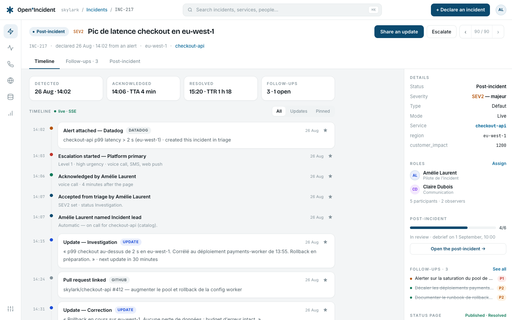
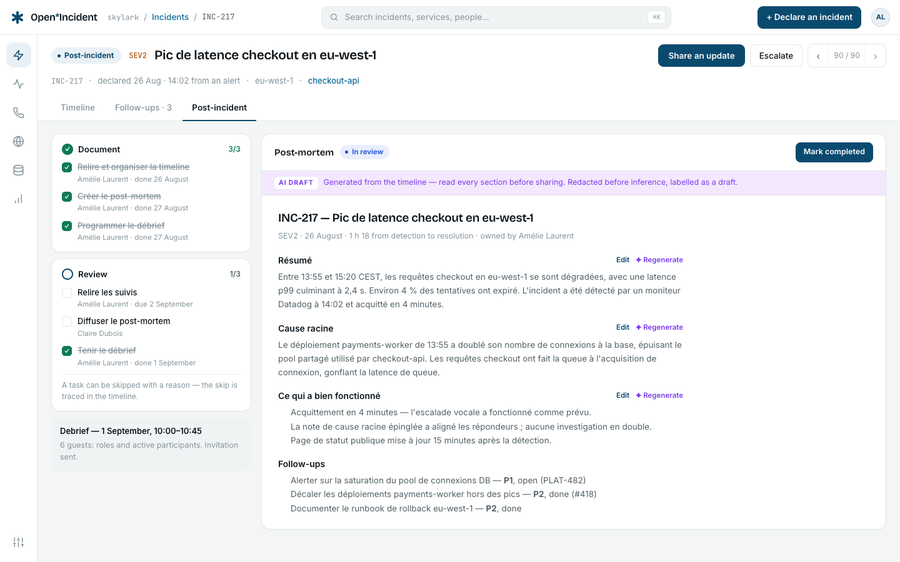
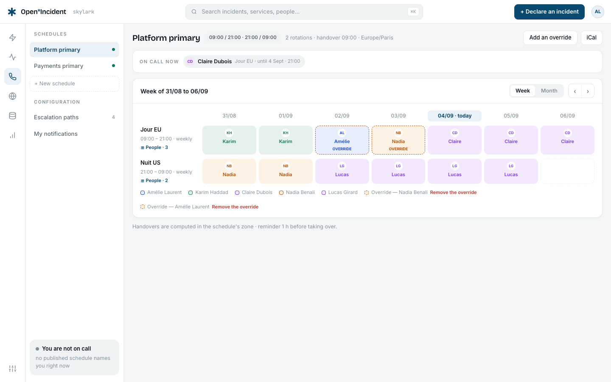
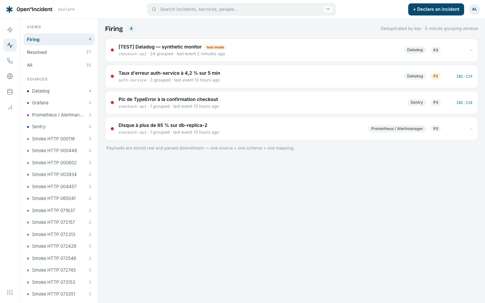
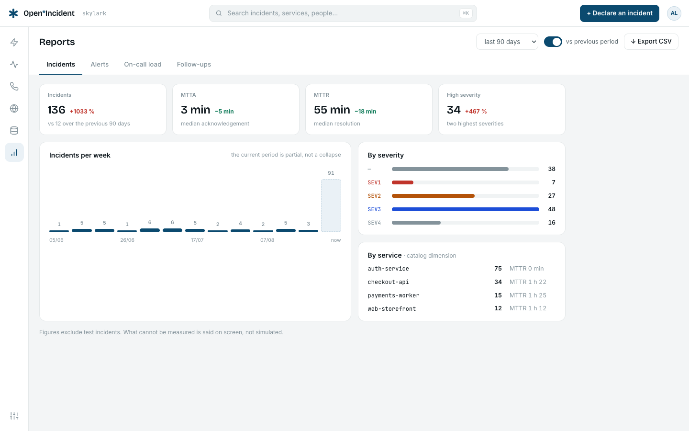
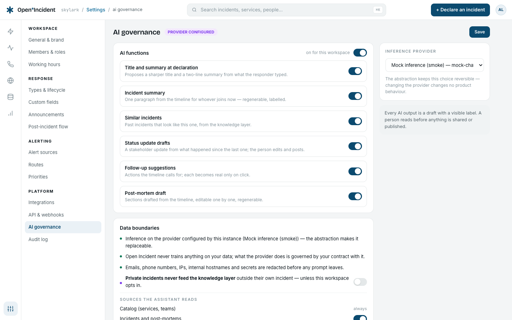
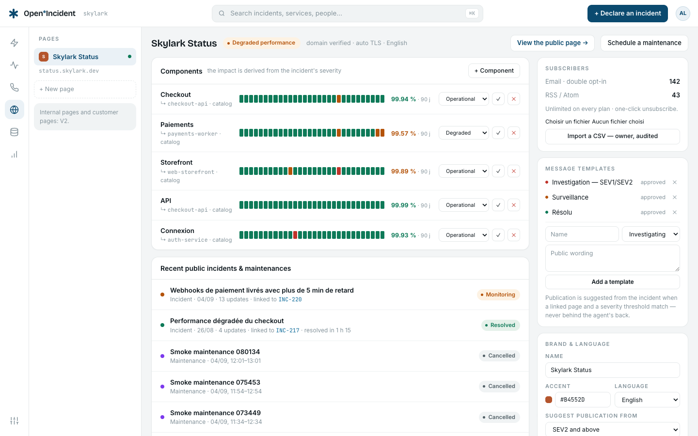
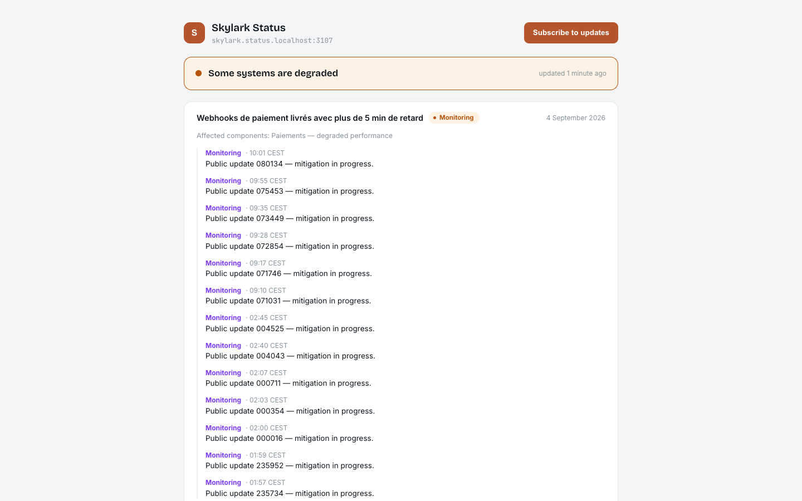

# Open Incident

**The open-source, European software reliability platform.** Incident response,
on-call, status pages and AI-assisted investigations — web-first, hosted in
Europe or on your own servers, with the whole core under AGPL.

[](LICENSE)
[](https://github.com/Open-Incident/open-incident/actions/workflows/ci.yml)
[](CHANGELOG.md)

> **Alpha.** The product works end to end — response, alerting and on-call,
> status pages, reports, the assistant, chat and tracker integrations, the
> enterprise edition — and is covered by an end-to-end smoke suite of
> sixty-five journeys, but APIs, schema and screens still move, and the vendor
> integrations have been exercised against mocks, not real accounts. Not
> production-ready yet; a very good time to try it and open issues.

## Why Open Incident

- **Web-first, chat as an adapter.** Every incident is pilotable from the
  browser and the API; Slack and Teams arrive as equals, never as a
  prerequisite.
- **Isolation you can prove.** Every workspace lives behind PostgreSQL
  row-level security that the application role cannot bypass — and an
  integration test reads across two workspaces to make sure nothing comes back.
- **Nothing hollow.** A control ships when its action acts; what is not built
  yet says so on screen instead of pretending.
- **Your data stays in Europe** — inference included: the assistant runs on the
  OpenAI-compatible endpoint you configure, and is redacted before anything leaves.
- **Open core, honest boundary.** Everything you need to run incident response
  is AGPL-3.0. The commercial licence covers the `ee/` directory only.

## What is here today

- **Incidents** — declaration (live, retrospective, test) with duplicate
  detection, a triage queue for alert-born incidents, status updates with
  severity and reminders, roles, a live timeline (server-sent events), pinned
  events, follow-ups with priorities and deadlines, the post-incident flow with
  its tasks and post-mortem.
- **Catalog** — teams, services and environments, the ownership chain the
  routing follows; your own types with their own attributes; entries edited on
  screen, imported from CSV, or fed by the API and the `catalog-importer` CLI
  from Backstage, a `catalog-info.yaml` or a file, with a lock for what code
  owns. Nothing referenced can be deleted: the usages are listed instead.
- **Settings** — workspace identity, members and roles with email invitations,
  incident types with their lifecycle, severities, a human-readable audit log.
- **Account** — language and timezone per member, email change, password
  change, account deletion — every one confirmed by email.
- **API and webhooks** — a versioned REST API with scoped keys and an OpenAPI
  document, signed outbound webhooks with retries and a delivery log.
- **On-call and alerting** — schedules with rotations and overrides, escalation
  paths, alert ingestion from monitoring tools with grouping and routing,
  heartbeats for crons that must keep pinging, sixty-day coverage of every
  schedule with its gaps and a daily reminder, notifications by email, SMS,
  voice, push, Slack and Teams when the instance has the provider.
- **Slack and Microsoft Teams** — a channel per incident, commands and cards
  to declare, update and escalate, acknowledgement from a direct message; in
  Slack, pins that become notes. Teams pairs by code, one team per workspace.
- **Issue trackers** — follow-ups exported to GitHub Issues, GitLab Issues,
  Jira or Linear from their row; a closed issue marks the follow-up done here.
- **Documentation tools** — post-mortems exported as pages to Confluence or
  Notion, linked back; the post-mortem here stays the source.
- **Status pages** — a public or internal page served by a separate minimal
  app, with components, uptime, incidents, maintenances, subscribers and feeds.
- **Reports** — incidents, alerts, on-call load and follow-ups over a period,
  compared with the previous one, exported as CSV; every figure from the
  workspace's own rows. On-call pay: rules per workspace, monthly reports
  drafted then published and frozen.
- **An assistant that proposes, never publishes** — behind any
  OpenAI-compatible endpoint you configure: title and summary at declaration,
  a timeline summary, similar incidents, update drafts, follow-up suggestions
  and a post-mortem draft, each labelled, each governed per workspace, with
  redaction before any prompt and a readable log of every call. Runbooks
  attached to services feed it when the workspace allows. Without a
  provider, the functions are shown as unavailable — nothing is faked.
- **Change events** — deploys, flags and configuration changes recorded by the
  API and shown next to the incident they may explain.
- **Brand and appearance** — the workspace logo (light and dark files) in
  object storage, served sandboxed; a dark theme per member with every token
  valued.
- **A purge that proves itself** — one command erases a workspace and then
  counts what remains, table by table and object by object, before it reports.
- **Translations** in English, French and German, with dictionary parity
  enforced at compile time.
- **QA from the admin** — owners run the repository's own suites (Playwright
  smoke on a throwaway workspace, unit tests, type check, lint, formatting)
  from Settings → QA, with live logs and the list of what failed, on an
  instance that runs from its source checkout.
- **Enterprise edition** (the `ee/` directory, commercially licensed, see
  below) — single sign-on with OpenID Connect or SAML 2.0 and just-in-time
  membership, SCIM 2.0 provisioning of members and teams, custom roles as
  permission sets. Switched on by `OI_ENTITLEMENTS` on a standalone install;
  shown as unavailable otherwise, never simulated.

## User guide

The guide lives in [`docs/guide`](docs/guide) as Markdown chapters with real
screenshots, and every member reads it inside the product under **Guide** in
the rail (`/app/docs`): installation and configuration, the concepts, every
screen, the integrations, the enterprise edition, operations, and eight
end-to-end use cases. The same files are meant for the public website.
Regenerate the illustrations from the demo workspace with
`pnpm --filter @openincident/smoke guide-shots`.

## Screens

Captured from the demo workspace by `pnpm --filter @openincident/smoke screenshots`
— real screens over real rows, no mock-up.

|                                                              |                                                         |
| ------------------------------------------------------------ | ------------------------------------------------------- |
|             |         |
|                      |                   |
|                     |     |
|  |  |

## Self-host in three commands

```bash
git clone https://github.com/Open-Incident/open-incident && cd open-incident
cp .env.example .env   # set BETTER_AUTH_SECRET, ENCRYPTION_KEY and APP_DB_PASSWORD
docker compose up -d
```

Open http://localhost:3000 (status pages answer on http://<page>.status.localhost:3001; set `BASE_DOMAIN` and `STATUS_BASE_DOMAIN` in `.env` for your own domains) — the stack (web, worker, PostgreSQL 17, Redis)
starts with the demo workspace: `amelie@skylark.dev` / `demo-openincident`.
Create your own workspace with
`docker compose run --rm migrate pnpm workspace:create -- --slug acme --name "Acme" --owner-email you@acme.example`

To erase a workspace for good, with the proof printed (rows counted per table,
storage objects listed):

`docker compose run --rm migrate pnpm workspace:purge -- --slug acme --yes`
and set `SEED_DEMO=false`.

## Development

```bash
corepack enable
pnpm install
cp .env.example .env
docker compose -f docker/docker-compose.yml up -d   # postgres, redis, mailpit
pnpm db:migrate && pnpm db:rls
pnpm db:seed && pnpm db:seed:auth
pnpm dev
```

Then open http://skylark.localhost:3100. See [CONTRIBUTING.md](CONTRIBUTING.md).

### Feeding the catalog from code

The importer is a client of the public API: an API key with the `write` scope
is all it needs, from anywhere.

```bash
pnpm catalog:import -- --source backstage --url http://backstage:7007 \
  --api https://acme.example.com --key oi_live_…
pnpm catalog:import -- --source github --repo acme/platform --path catalog-info.yaml \
  --api … --key …
pnpm catalog:import -- --source local --file ./catalog.yaml --lock --api … --key …
pnpm catalog:import -- --source local --file ./squads.csv --type squad --api … --key …
```

Backstage groups become teams and components become services (owner,
repository, tier). A local or inline document is either Backstage entities or
an Open Incident bundle — `{ types: [...], entries: [...] }` — and `--lock`
makes the declared types read-only on screen. `--dry-run` parses and prints
without sending; a bundle with one invalid item writes nothing and lists
every problem.

## Licensing

Open Incident is open-core, and the licence boundary is the `ee/` directory:

- **Core — [AGPL-3.0](LICENSE).** Everything outside [`ee/`](ee/).
- **`ee/` — commercial licence.** Enterprise features (SAML/SCIM, custom roles,
  advanced audit, customer status pages) land there as they are built. The
  source is visible and free to use in development and testing; production use
  requires a commercial agreement — see [`ee/LICENSE`](ee/LICENSE).

## Security

Please report vulnerabilities privately — see [SECURITY.md](SECURITY.md).
