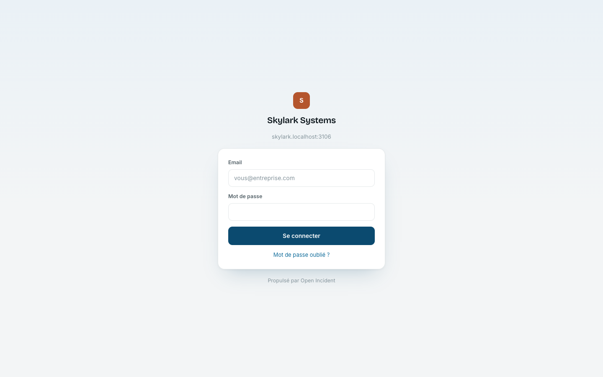
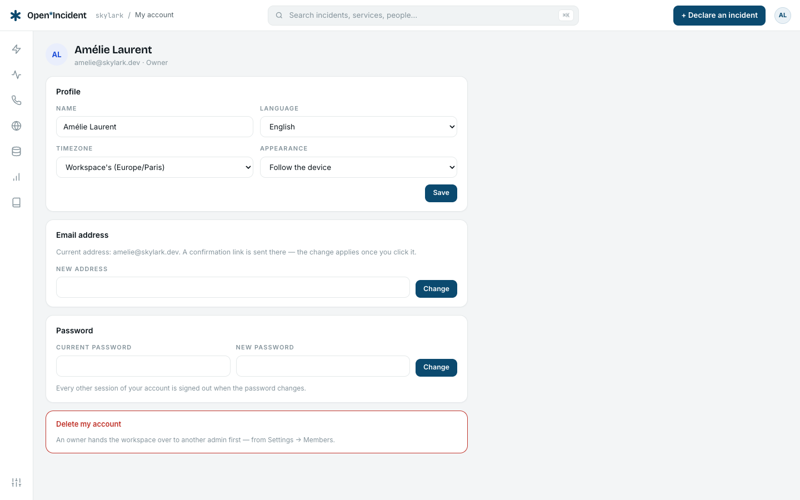
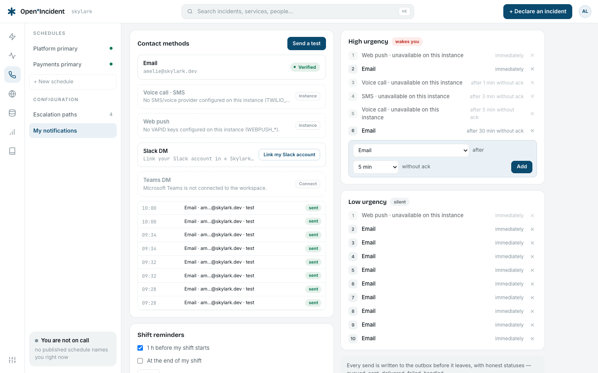

## Joining a workspace

You enter a workspace in one of three ways:

1. **An invitation.** An administrator invites your email from **Settings → Members & roles**. You receive an email with a link valid for seven days; the page asks for your name and a password, creates your account and signs you in. If you already have an account on the instance (from another workspace), the same link simply adds the membership.
2. **Single sign-on** (enterprise edition). The sign-in page shows a **Continue with …** button per connection; your identity provider signs you in, and a member is created on the spot with the role the connection gives to newcomers.
3. **Provisioning** (enterprise edition). Your identity provider created the member through SCIM; you then sign in through SSO, or through the invitation email the provisioning sent.

## Signing in

Go to your workspace's address (`https://acme.your-domain.example`, or the bare domain on a single-workspace instance). The page shows the workspace's name and its address — the two details that distinguish it from a copy of it.

- **Email and password** is always available, unless the workspace enforces single sign-on for your email domain.
- **Continue with Google / Microsoft / GitHub** appears when the operator configured that provider on the instance.
- **Forgot your password?** sends a link valid for one hour. Setting a new password signs out every other session of your account — the recovery move after a possible compromise.

The sign-in endpoint is rate limited: after a burst of attempts you are told to wait ten seconds. This is not a wrong password.

> A viewer signs in like anyone else and reads everything; only the controls that act are absent for them.

## My account

Open the menu under your initials in the top bar and choose **My account**.

| Setting               | What it does                                                                                                                                                                                                  |
| --------------------- | ------------------------------------------------------------------------------------------------------------------------------------------------------------------------------------------------------------- |
| **Name**              | How you appear in timelines, in chat channels and in emails.                                                                                                                                                  |
| **Language**          | English, French or German. By default you follow the workspace's language; an override is yours alone.                                                                                                        |
| **Timezone**          | Times on screen — and your on-call shifts — are shown in it. By default the workspace's.                                                                                                                      |
| **Appearance**        | Follow the device, light or dark. Every design token has a dark value; the choice is stamped before the first paint, so nothing flashes.                                                                      |
| **Email address**     | A confirmation link goes to the _new_ address; the change applies once you open it.                                                                                                                           |
| **Password**          | Changing it signs out every other session.                                                                                                                                                                    |
| **Delete my account** | Removes your sign-in identity after a confirmation link (valid one hour). What you did stays attributed to your name in the timelines — the audit trail requires it. An owner hands the workspace over first. |

## Your notifications

**On-call → My notifications** is where you decide how the product reaches you when you are paged.

### Contact methods

- **Email** is always available: it reuses the instance's mail transport.
- **SMS** and **Voice call** need a phone number in international format (`+33…`). A code is sent; enter it to verify. They need the operator to have configured Twilio on the instance; otherwise the row says so.
- **Web push** is enabled per browser: click **Enable on this browser**, accept the browser's prompt. It wakes the screen even when the tab is closed. Needs VAPID keys on the instance.
- **Slack DM** and **Teams DM** appear when the workspace connected Slack or Microsoft Teams: click **Link my Slack account** (the product finds your Slack user by email) and pages arrive as a direct message with an **Acknowledge** button.

### Two rules, by urgency

- **High urgency — wakes you**: the channels used, in order, when an alert or an escalation is urgent. Each step is _immediately_ or _after n minutes without acknowledgement_. When you link Slack or Teams, a step is added at the front of this rule.
- **Low urgency — silent**: what happens for the rest. Email by default.

A channel the instance cannot send through is shown as _unavailable on this instance_; it is never silently skipped.

### Test it

**Send a test** sends a real message through every channel of your high-urgency rule. The outbox below shows each delivery with its status — queued, sent, delivered, failed, handled. This is the same outbox every real page goes through.

### Shift reminders

Tick **1 h before my shift starts** and **At the end of my shift** to be told when a rotation puts you on or off call.

## Acknowledging a page

A page reaches you with a one-tap link (email, SMS, push) or a button (Slack, Teams, voice: press **4**). Acknowledging stops the escalation timers, tells the team you are on it and, when the page came from an incident, adds you to the incident. The same **Acknowledge** button is on the alert's page in the product.
