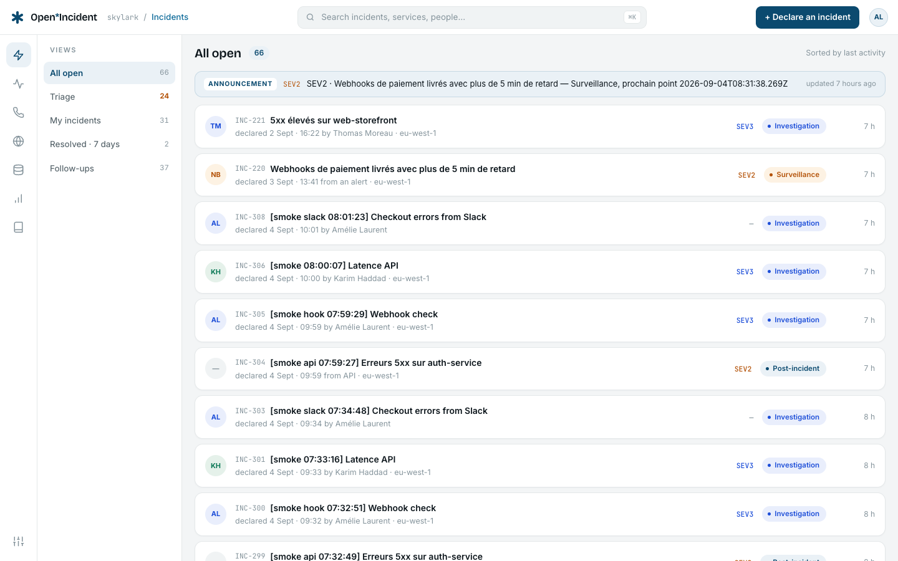
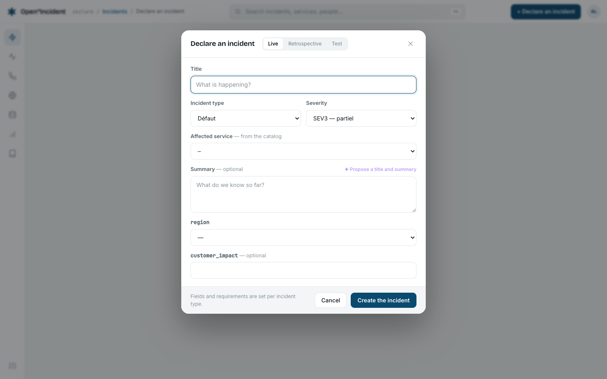
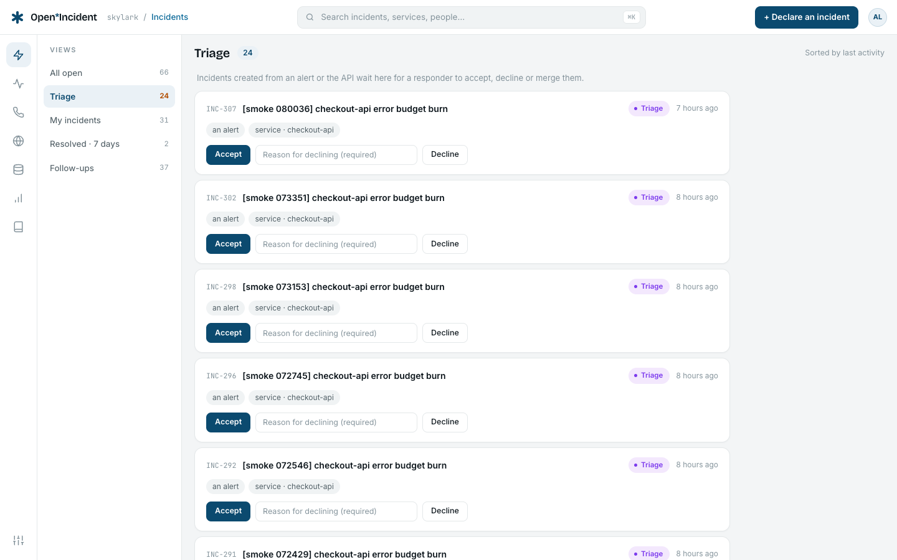
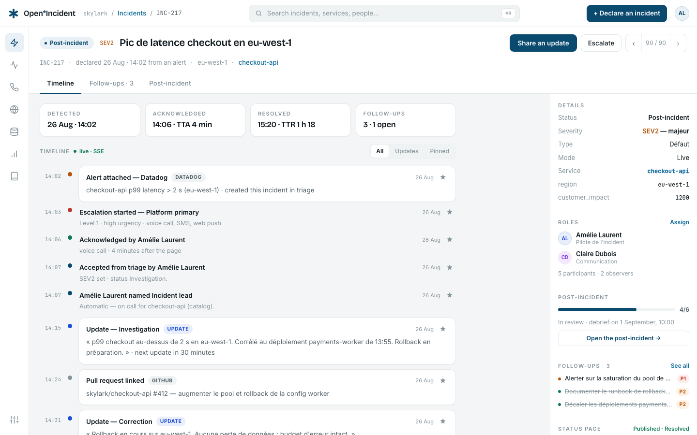
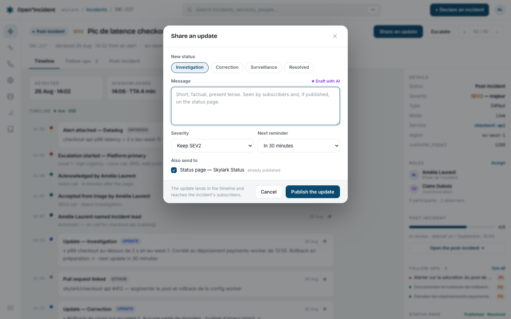
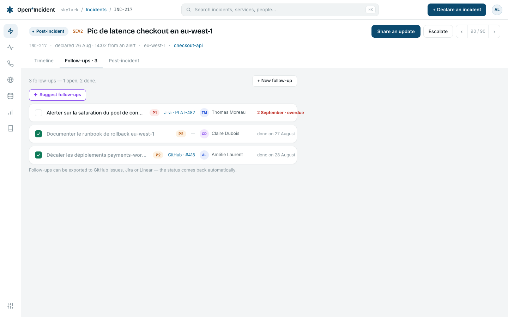

## The incidents list

The left column offers five **Views**:

| View                  | Shows                                                                                                           |
| --------------------- | --------------------------------------------------------------------------------------------------------------- |
| **All open**          | Every incident in the triage, active or post-incident phase.                                                    |
| **Triage**            | Incidents created by an alert or the API that wait for a responder.                                             |
| **My incidents**      | Where you hold a role or declared it.                                                                           |
| **Resolved · 7 days** | What was resolved this week.                                                                                    |
| **Follow-ups**        | Every open follow-up of the workspace, with its deadline and the policy (P1 follow-ups closed within _n_ days). |

Each card shows the reference (`INC-217`), the title, the severity and status chips, the affected service, who declared it and when, and the number of updates. A private incident carries a lock. Announcements published by rules sit above the list for their audience.

Press <kbd>⌘K</kbd> / <kbd>Ctrl K</kbd> anywhere to open the **command palette**: search incidents, services and people; jump to a screen; declare an incident; share an update on the incident you are viewing.

## Declaring an incident

**+ Declare an incident** in the top bar, or <kbd>⌘K</kbd> → _Declare an incident_.

1. **Mode** — _Live_ for what is happening now; _Retrospective_ to record something that already happened (you set when it started); _Test_ for a drill, excluded from reports, announcements and status pages.
2. **Title** — what is happening, in one line. As you type, the product looks for an open incident with a similar title and offers to **Join** it instead of opening a duplicate.
3. **Incident type** — each type carries its own lifecycle and its own form. A type may be restricted to one team, and may start its incidents private.
4. **Severity** — shared by every type, ordered. It decides who is announced to, whether a status page suggests publication, and whether the post-incident flow starts at resolution.
5. **Affected service** — from the catalog. It binds the incident to its owner team and to the status page components of that service.
6. **Summary** and the type's **custom fields** — required or optional, as the type says.

If an inference provider is configured, **Propose a title and summary** drafts both from what you typed; keep, edit or ignore.

**Create the incident** opens it in the active phase, with the status the type enters on, and you as _declared by_. When the workspace has Slack or Teams connected with automatic channels, a channel is created; when a war-room template is set, the video link is attached.

> A responder or above declares. A viewer sees the button greyed and cannot reach the form.

## Triage

Incidents that come from an alert route set to _conditional_, or from the API, start in **Triage**: nobody is paged, no status page suggested, until a responder decides.

- **Accept** sets a severity and the type's first active status; the escalation configured by the route starts now.
- **Decline** with a reason (required) closes the incident; the reason is traced.
- **Merge** attaches it to another open incident: alerts and timeline events follow, and the merged incident points at its target.

## The incident page

### Header

The reference and title (rename with the pencil), the chips (severity, status, mode, private), and five metrics: **Detected**, **Acknowledged** (with the time to acknowledge), **Resolved** (with the time to resolve, or _ongoing_), **Status**, **Follow-ups** (with how many are open). The arrows move to the previous or next open incident.

### Actions

| Action                       | What it does                                                                                                                                      |
| ---------------------------- | ------------------------------------------------------------------------------------------------------------------------------------------------- |
| **Share an update**          | The main gesture: a message, a new status, a severity, the next reminder, and where to send it (see below).                                       |
| **Escalate**                 | Pages people through an escalation path, with a preview of who is on call right now.                                                              |
| **Assign**                   | Gives a role (incident lead, communication lead, any role the workspace defined) to a member. Timeline events say who named whom.                 |
| **Make private / visible**   | Private incidents are seen by role holders and explicit guests only, and never feed the assistant's knowledge layer unless the workspace opts in. |
| **Create the chat channel**  | When channels are not automatic.                                                                                                                  |
| **Join the war room**        | The video link when a template is configured.                                                                                                     |
| **Open the post-incident →** | Once resolved.                                                                                                                                    |

### Sharing an update

- **New status** — one of the type's active statuses, or **Resolved**. A resolving status ends the active phase; if the severity asks for it, the post-incident flow starts.
- **Message** — short, factual, present tense. It reaches the incident's subscribers and, if published, the status page.
- **Severity** — keep or change; a change is a timeline event of its own.
- **Next reminder** — in _n_ minutes, or none. When the reminder falls due without an update, the incident lead is reminded and the timeline says _Update overdue_.
- **Also send to** — the Slack or Teams channel of the incident; and the status page when the incident is linked to one (see [Status pages](status-pages)). Nothing is published on a status page without this tick.
- **Draft with AI** — when configured, drafts the message from what happened since the last update. You edit and post.

### The timeline

Live over server-sent events: new events appear without a reload. Filter **All**, **Updates** or **Pinned**. Every event says who did what: declared, accepted from triage, roles named, updates, severity and status changes, notes, alerts attached and grouped, escalations started and acknowledged (with the minutes after the page), links and pull requests added, deployments, follow-ups created and completed, publication on a status page, merges, reopenings.

**Pin** any event to bring it into the **Pinned** filter — the short version of the story for whoever joins now. In Slack, a :pushpin: reaction on a message pins it to the timeline as a note.

### Details and roles

The right column shows the incident's fields (status, severity, type, mode, service, custom fields), the roles with their holders, participants and observers, the linked alerts with their escalation, the chat channel, and the status page state (**Published · Monitoring**, or _meets the publication threshold — nothing is published without you_).

### The assistant's panel

When the workspace allows it: an **AI summary** of the timeline (regenerable, labelled), **Similar incidents** (by meaning when embeddings are configured, by title otherwise — and it says which), the **Runbooks** of the affected service, and the **Recent changes** recorded around the incident (deploys, flags, config changes posted by CI through the API). See [The assistant](ai).

## Escalating by hand

**Escalate** opens the dialog: choose a published escalation path and read **Who will be paged** — level by level, the members on call right now with their urgency, acknowledgement window and retries. _This path reaches nobody right now — check the schedule_ is said before you confirm, never after. Confirming pages these people for real, following their own notification rules. The escalation then appears in the details with its status: in progress, acknowledged (by whom, when), resolved, exhausted, cancelled.

## Follow-ups

The **Follow-ups** tab lists what has to be done after the incident: a title, a **priority** (with the workspace's closure policy), an assignee (a member or a catalog team), a deadline. **+ New follow-up** adds one; the assistant can **Suggest follow-ups** from the timeline — each becomes real only when you create it.

**Export** sends a follow-up to a connected tracker (GitHub Issues, GitLab Issues, Jira, Linear); the row keeps the link, and a closed issue marks the follow-up **Done** here with a line in the timeline. See [Trackers and documentation tools](trackers-docs).

## Alerts attached to the incident

An incident opened from an alert keeps it: the details list the **Linked alerts** with their state, and the alert's own page points back (see [Alerts](alerts)). An alert resolved at the source is written in the timeline; whether that ends the escalation is decided by the route.

## Chat and war room

With Slack or Teams connected, the incident has a channel: a header card kept current (severity, status, lead, next update), every update mirrored, notes from the channel pinned to the timeline, and — in Slack — a :white_check_mark: reaction that turns a message into a follow-up. The commands are described in [Slack](slack) and [Microsoft Teams](teams).

## Resolving, reopening, closing

A resolving status **resolves** the incident: the time to resolve is fixed, subscribers are told, the status page (if published) shows _Resolved_, the announcement closes. If the severity asks for it, the **post-incident** phase starts (see [Post-incident](post-incident)); otherwise the incident is **closed**. A closed incident can be reopened for 30 days; the reopening is an event like any other.
