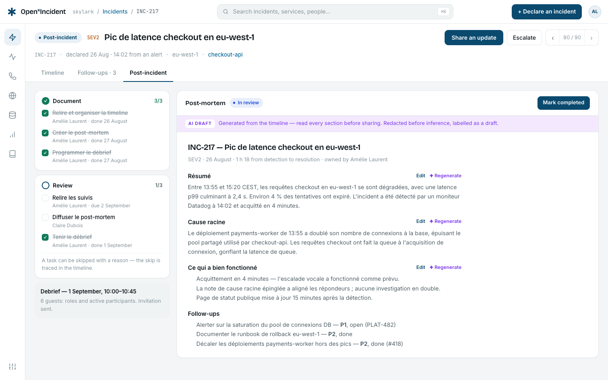

## When the flow starts

The **Post-incident** tab of an incident becomes active when the incident is resolved and its severity asks for the flow. Each severity says, in **Settings → Types & lifecycle → Severities**, whether it starts the flow: _always_, _yes_, _opt-in at closure_, or _no_. The timeline records _The post-incident flow starts (SEV2 rule)_.

## Two phases, their tasks

The flow is two phases — **Document**, then **Review** — each with the tasks configured in **Settings → Post-incident flow**: write the timeline of events, identify contributing factors, schedule the debrief, review the follow-ups, publish the post-mortem…

Each task has a default assignee (the incident lead, the communication lead, or nobody) and a deadline counted in days after entering the phase. A task is **done** with a click, or **skipped with a reason** — the skip is traced in the timeline. The incident leaves the post-incident phase and **closes** when every task is done or skipped.

> Tasks are copied into the incident when it enters the flow. Changing the flow's definition later affects the next incidents, never the ones already in it.

## The debrief

Scheduling a debrief from the tab sets a date and a slot and sends an invitation to the guests — the role holders and the active participants. The timeline says _debrief scheduled on …_.

## The post-mortem

The workspace calls it what it likes — the term is configured in **Settings → Post-incident flow** and used everywhere. It has six sections: **Summary**, **Timeline**, **Impact**, **Root cause**, **What went well**, **What to improve**. Each is edited in place.

Its status moves by hand: **In progress** → **Send to review** → **In review** → **Mark completed**. Publication is an event in the timeline.

### The AI draft

With an inference provider configured and the capability allowed in **Settings → AI governance**, **Draft with AI** fills the six sections from the incident's timeline. Every section carries the **AI DRAFT** label until a person edits it; **Regenerate this section from the timeline** redoes one section without touching the others. The prompt is redacted before it leaves (emails, phone numbers, IPs, hostnames, secrets). Read every section before sharing.

## Exporting the post-mortem

When Confluence or Notion is connected in **Settings → Integrations**, the tab shows **Export to Confluence** / **Export to Notion**. The written sections become a page — Confluence storage format in the configured space, or Notion blocks under the configured parent page — with a link back to the incident. The page's address stays on the post-mortem (**Exported page**) and in the timeline. Exporting again creates a new page; nothing there is overwritten. The post-mortem here stays the source.

At least one section must be written before exporting; an empty post-mortem is refused with a message, not exported blank.

## Follow-ups after the incident

The **Follow-ups** tab and the **Follow-ups** view of the incidents list carry the actions the post-mortem calls for. The closure policy (P1 follow-ups closed within _n_ days) is shown above the list, and the **Reports → Follow-ups** tab measures closure by team against it. Exporting to a tracker keeps the status in sync: a closed issue marks the follow-up done here.
