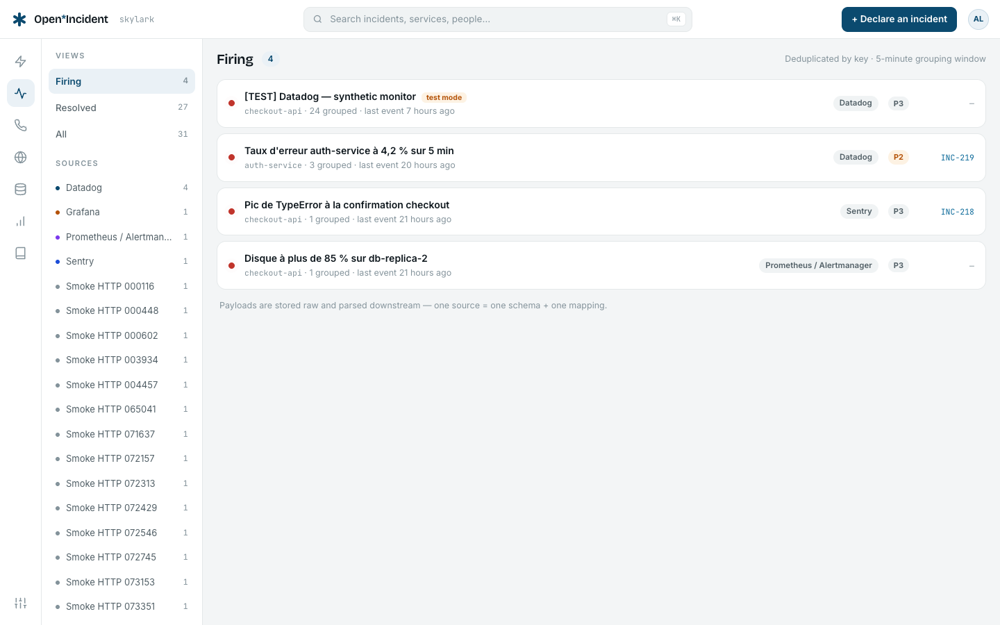
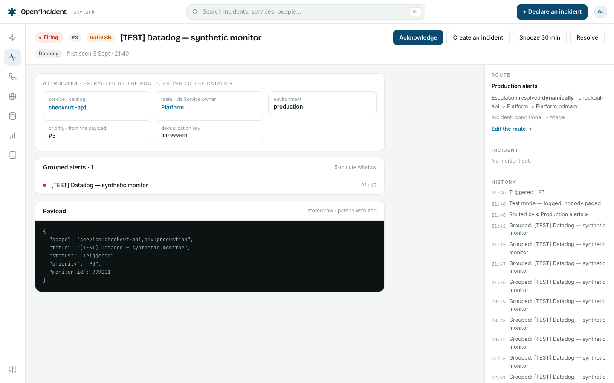

## From a webhook to an alert

Every monitoring tool posts to its own **alert source**: one endpoint and one secret per source, created in **Settings → Alert sources** (Datadog, Prometheus/Alertmanager, Grafana, Sentry, CloudWatch, Uptime Kuma, generic HTTP, inbound email). The payload is stored raw, parsed by the source's mapping into **attributes** — service, environment, team, priority, region, whatever the mapping extracts — and bound to the catalog: the `service` attribute names a catalog service, the team comes from the service's owner.

Two mechanisms keep the noise down before anything else happens:

- **Deduplication by key**: the same key from the same source is one alert with more events, not a new alert.
- **Grouping**: alerts of the same route within a five-minute window are grouped under the first one.

Then the **routes** are tried in order; the first whose filters all match decides: which escalation (static path, dynamic through the catalog, or none), whether an incident opens (never, always, conditionally in triage), which priority and urgency, whether the notification is deferred to let grouping absorb a burst. No route matching means: logged, nobody paged.

## The alerts list

Views **Firing**, **Resolved**, **All**; the sources with their counts on the left; each row with the alert's title, its source, priority, service, how many events are grouped, when the last event arrived, and whether it is acknowledged or in test mode.

## An alert

### The three gestures

| Gesture           | Effect                                                                                                                                                                                                                |
| ----------------- | --------------------------------------------------------------------------------------------------------------------------------------------------------------------------------------------------------------------- |
| **Acknowledge**   | Stops the escalation timers and tells the team you are on it. Undo with **Undo acknowledgement**. Acknowledging from a page (email link, SMS link, push, Slack or Teams button, voice key **4**) is the same gesture. |
| **Snooze 30 min** | Defers the notifications; the alert stays firing.                                                                                                                                                                     |
| **Resolve**       | Ends the alert and its escalation. A resolution from the source does the same when the route says so.                                                                                                                 |

**Create an incident** opens an incident from the alert — with the alert's title and service — or attaches it to an open one.

### The escalation card

While an escalation runs, the card shows the current level, who was paged and when, their urgency, and the countdown to the next level or to exhaustion. Then it says how it ended: acknowledged by whom, resolved at the source, exhausted (nobody acknowledged), cancelled.

### Route, incident, history

The **Route** block names the route that matched and how it escalates: _dynamically — service → owner team → path_, statically through one path, or _no escalation — logged only_; and its incident rule. **Edit the route →** opens it in the settings. The **Incident** block links to the incident the alert created or joined. The **History** is the alert's own log: triggered with its priority, routed by which route (or _no route matched_), level 1 notified and who, incident created in triage, grouped, acknowledged by whom through which channel, snoozed, resolved by whom or at the source, notification deferred, test mode.

### Attributes and payload

The extracted attributes with their origin (_service · catalog_, _team · via Service.owner_, _priority · from the payload_, the deduplication key), and the raw payload as it was received — stored as JSON, parsed downstream.

## Test alerts

Every source in **Settings → Alert sources** has a **Test** button that sends a real alert end to end in test mode: logged and routed, nobody paged, no incident. The alert appears in the list with the _test mode_ chip. Routes can also run in test mode as a whole while their filters are verified.

## Heartbeats

A cron that stops pinging is an alert too: **Settings → Heartbeats** gives each job a URL; silence beyond the interval plus the grace raises an alert through the workspace's own managed _Heartbeats_ source, routed like any other. See [Alerting settings](settings-alerting).

## Reading the noise

**Reports → Alerts** shows the volume by source, the share of alerts that resolve themselves in under five minutes (candidates for grouping or higher thresholds), the alert → incident conversion, and the **recurring alerts** with a shortcut to their route. See [Reports](reports).
