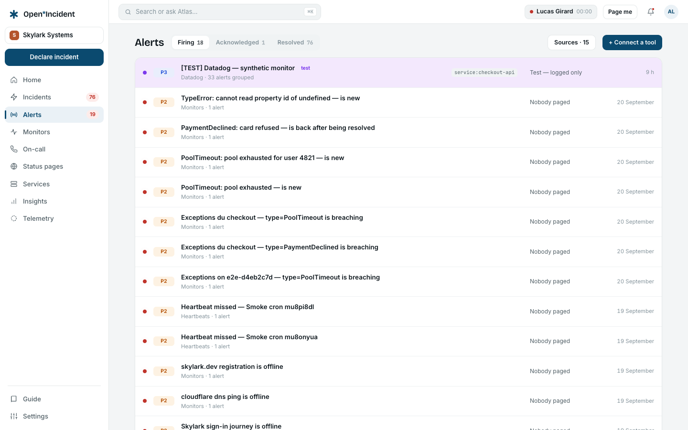
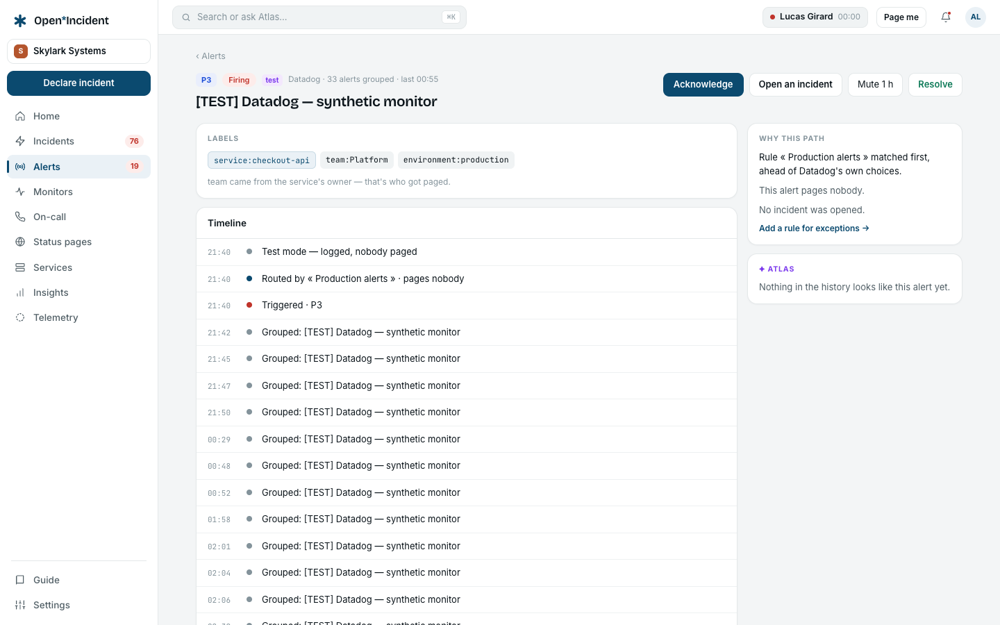

## Getting started

The welcome screen — **Home**, until the workspace has had its first page — takes a workspace from nothing to "an alert paged someone" in three steps, each of them real:

1. **Who should we page?** You, a teammate, or a schedule; a verified phone is enough. Behind it, a published escalation path is created and named on the rule that catches every alert. Refine the path later — levels, retries, working hours — in **On-call → Paths**.
2. **Where do alerts come from?** Pick the tool in a grid, name it, get an endpoint and a secret shown once. HTTP covers any tool not listed; a URL the product watches for you is a [monitor](monitors).
3. **Send a test page.** A real page, on your phone, right now — through the whole pipeline. Open the alert afterwards: its history says which rule caught it, who it paged and why.

Nothing has to be declared first. Services appear on their own, the moment an alert or a monitor names one; giving one an owner team in **Services** is what later lets a route page _the team that owns the service_ rather than a fixed path.

If no tool is sending anything yet — or if what you want watched is a URL, a certificate, a purchase flow or a query over your own logs — the product can produce the alert itself. See [Monitors](monitors): a monitor posts to this same pipeline through a managed source, so everything in this chapter applies to it unchanged.

## From a webhook to an alert

Every monitoring tool posts to its own **alert source**: one endpoint and one secret per source (Datadog, Prometheus/Alertmanager, Grafana, Sentry, CloudWatch, Uptime Kuma, generic HTTP). The payload is stored raw and parsed by the source's **mappings** into the workspace's **attributes** — service, team, environment, region, the tool's own severity, and any you add in **Settings → Severities & attributes → Attributes**. An attribute typed `service` or `team` is resolved against the workspace's real services and teams — an unknown service name is recorded as a new one, seen in traffic, and the team is derived from the service's owner when the payload gives none. Every other attribute is just a label carried by the alert. The source then decides the **priority** — the same for every alert, or read from a payload field with a value map; a label the tools use (_critical_, _warning_) matches a priority by its aliases — and may **filter** out what it does not want (resolutions always pass).

Two mechanisms keep the noise down before anything else happens:

- **Deduplication by key**: the same key from the same source is one alert with more events, not a new alert. Repeats merge attributes per the attribute's strategy — first wins, last wins, accumulate, highest priority — until the alert pages or opens an incident, after which the record is locked.
- **Grouping**: a route groups alerts sharing a key — the attributes it chooses — within a window, fixed or restarting at each alert that joins; joiners are handled with the first one and page again only if the route says so.

Then the **routes** are tried in order; the first whose conditions hold decides: who to page (rules that stack — a path, or the path a `service` or `team` attribute leads to, with a fallback), whether an incident opens (never, always, or in triage when the priority pages), with what type, phase, severity and custom fields, whether the triage incident is declined when the alert resolves, which Slack channel to post to, and whether the first page waits. No route matching means: logged, nobody paged — and the history says so.

Every source page has a **tester**: paste a payload and read what the pipeline would do with it — attributes, priority, route, who it pages, the incident — before sending it as a test or for real.

## The alerts list

Views **Firing**, **Resolved**, **All**; the sources with their counts on the left; each row with the alert's title, its source, priority, service, how many events are grouped, when the last event arrived, and whether it is acknowledged or in test mode.

## An alert

### The three gestures

| Gesture           | Effect                                                                                                                                                                                                                |
| ----------------- | --------------------------------------------------------------------------------------------------------------------------------------------------------------------------------------------------------------------- |
| **Acknowledge**   | Stops the escalation timers and tells the team you are on it. Undo with **Undo acknowledgement**. Acknowledging from a page (email link, SMS link, push, Slack or Teams button, voice key **4**) is the same gesture. |
| **Snooze 30 min** | Defers the notifications; the alert stays firing.                                                                                                                                                                     |
| **Resolve**       | Ends the alert and its escalation. A resolution from the source does the same when the route says so.                                                                                                                 |

**Create an incident** opens an incident from the alert — with the alert's title and service — or attaches it to an open one.

### The escalation card

While an escalation runs, the card shows the current level, who was paged and when, their urgency, and the countdown to the next level or to exhaustion. Then it says how it ended: acknowledged by whom, resolved at the source, exhausted (nobody acknowledged), cancelled.

### Route, incident, history

The **Route** block names the route that matched and how it escalates — the paths its rules resolved to, or _no escalation — logged only_ — and its incident rule. **Edit the route →** opens it in the settings. The **Incident** block links to the incident the alert created or joined. The **History** is the alert's own log: triggered with its priority, routed by which route (or _no route matched_) and who it pages — with the rules it skipped and the required attributes it lacked — level 1 notified and who, incident created in triage, grouped, acknowledged by whom through which channel, snoozed, resolved by whom or at the source, notification deferred, test mode. **Notes** under it hold written context — what was checked, why it was resolved, a hand-over — without an incident.

### Attributes and payload

The extracted attributes with their origin (_service_ matched to a known service, _team · via Service.owner_, _priority · from the payload_, the deduplication key), and the raw payload as it was received — stored as JSON, parsed downstream. The list has a search box over titles and attributes.

## Test alerts

Every source has a **Test** button that sends a real alert end to end in test mode: logged and routed, nobody paged, no incident. The alert appears in the list with the _test mode_ chip. The source page's tester does the same with any payload you paste, after showing what it would do. Routes can also run in test mode as a whole while their conditions are verified, and are previewed against the last alerts before saving.

## Heartbeats

A cron that stops pinging is an alert too: **Monitors → Heartbeats** gives each job a URL; silence beyond the interval plus the grace raises an alert through the workspace's own managed _Heartbeats_ source, routed like any other. See [Monitors](monitors#dead-mans-switches-use-heartbeats).

## Reading the noise

**Reports → Alerts** shows the volume by source, the share of alerts that resolve themselves in under five minutes (candidates for grouping or higher thresholds), the alert → incident conversion, and the **recurring alerts** with a shortcut to their route. See [Reports](reports).
