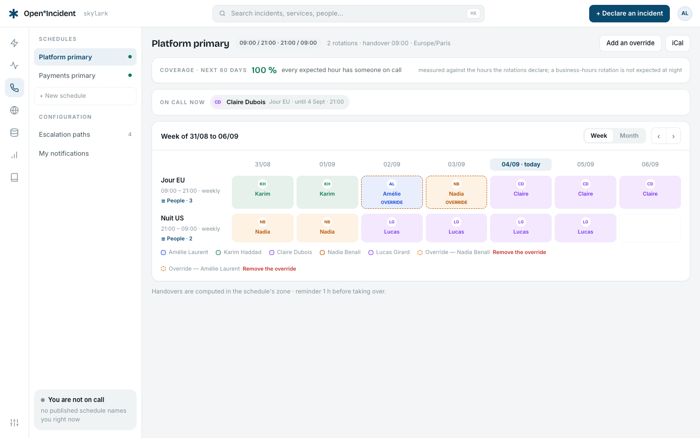
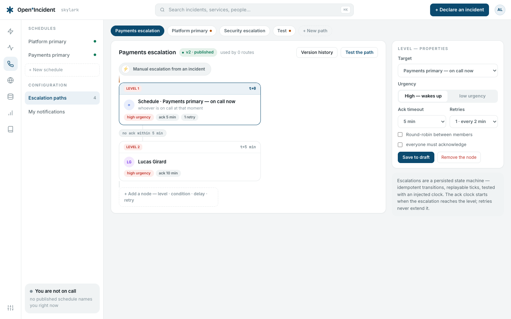
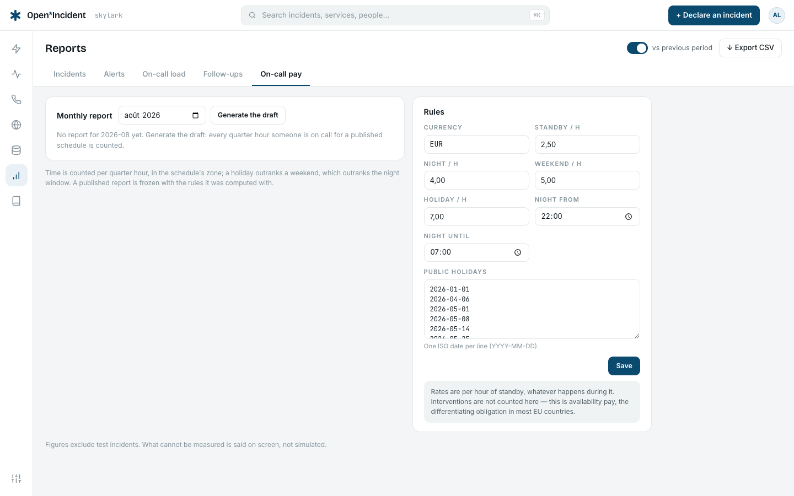

## Am I on call?

The **On-call** section opens on the schedules with, at the top, **You are on call until …** or **You are not on call** — computed from every published schedule that names you.

## Schedules

A **schedule** is a rotation: ordered members, an interval (daily, weekly, monthly, weekends), a handover time, a timezone, optional active hours (a business-hours rotation is not expected at night). Several **rotations** can layer in one schedule.

- **+ New schedule** creates it as a **draft**: it pages nobody until you **Publish** it. iCal is available from creation — subscribe your calendar to the feed.
- The **week** and **month** views show who is on call; weekends in bold, _today_ marked. The month view shows who is on call at noon each day.
- **People** lists the rotation in order; adding a member applies from the next handover — past slots never move.

### Overrides

An **override** wins over the rotation for its slot. **Add an override** with a member and a period; choosing _nobody_ records an assumed gap. Clicking a slot in the week view offers _who takes this slot?_ — one click creates an override on that slot only, the rotation untouched, everything traced.

### Cover me

**Cover me…** offers your shift to the other members of the schedule; the first to accept (from the email or the notification) gets an override for it, and you are told.

### Coverage

Each schedule shows **Coverage · next 60 days**: the share of the expected hours that has someone on call, measured against the hours its rotations declare, and the list of gaps — an empty turn, a turn with nobody, an override that removed the only person — with the hint _cover it with an override_. Managers receive one digest a day at most for the gaps of the coming week. **Reports → On-call load** carries the figure across schedules.

## Escalation paths

**On-call → Escalation paths** lists the paths, each with its published version, the routes that use it, and a **Version history**.

A path is a graph of nodes:

| Node          | What it does                                                                                                                                                                                                                                                                              |
| ------------- | ----------------------------------------------------------------------------------------------------------------------------------------------------------------------------------------------------------------------------------------------------------------------------------------- |
| **Level**     | Pages targets: a schedule (_on call now_, _next on call_, _everyone on the schedule_), a team, or named members. An urgency (high wakes up, low stays silent), an acknowledgement timeout, retries (every _n_ minutes), and whether everyone must acknowledge or a round-robin picks one. |
| **Condition** | Branches on the working hours (_Working hours "EU business"?_), the priority (_P1 to P2?_) or the urgency. YES continues to one branch, NO to the other, or ends the escalation.                                                                                                          |
| **Delay**     | Waits _n_ minutes, or until a working-hours set opens.                                                                                                                                                                                                                                    |
| **Retry**     | Loops back to a level up to _n_ times, every _n_ minutes.                                                                                                                                                                                                                                 |
| **Reassign**  | Hands the escalation over to another path.                                                                                                                                                                                                                                                |

### Draft and versions

Editing happens on a **draft**; **Publish v*n*** makes it current. Running escalations finish on the version they started with; new ones take the new one. **Discard the draft** goes back to the published version. Only owners and admins edit paths.

### Dry run

**Test the path** answers _who would be paged right now_: level by level, at which minute, which members, with which acknowledgement window — or _nobody would be paged_ when the schedules are empty. Run it after every change.

### How a page travels

1. A route matches an alert (or a responder escalates an incident) and names a path — statically, or through the catalog chain service → owner team → path.
2. The escalation reaches level 1: each target is resolved to people (who is on call on the schedule now), and each person is notified through the channels of their **own** notification rule for that urgency — email, SMS, voice, push, Slack DM, Teams DM.
3. The acknowledgement clock starts when the escalation reaches the level; retries within the level never extend it.
4. Nobody acknowledged in time: the next node fires. Someone acknowledged: the timers stop, the timeline and the alert's card say who and how many minutes after the page.
5. Every attempt is written to the outbox with its status before it leaves, so **My notifications** shows what really went out.

The engine is a persisted state machine: ticks are idempotent and replayable, so a worker restart never pages twice and never forgets a level.

## My notifications

See [Sign in and your account](account#your-notifications): contact methods, the two urgency rules, a real test, shift reminders.

## On-call pay

The workspace can price availability: **Reports → On-call pay** holds the **Rules** (hourly rates for standby, night, weekend and public holiday; the night window; the holiday dates; the currency) and a **Monthly report** per period.

- **Generate the draft** counts every quarter hour someone is on call for a published schedule, in the schedule's zone, and prices it by category: a holiday outranks a weekend, which outranks the night window.
- **Recompute the draft** at will while the month is open; **Publish** freezes it with the rules it was computed with.
- A member sees their own lines of published months; a manager sees everyone. **Export CSV** exports the month.

> Interventions are not counted here — this is availability pay, the obligation that applies in most EU countries. Rates are per hour of standby, whatever happens during it.
