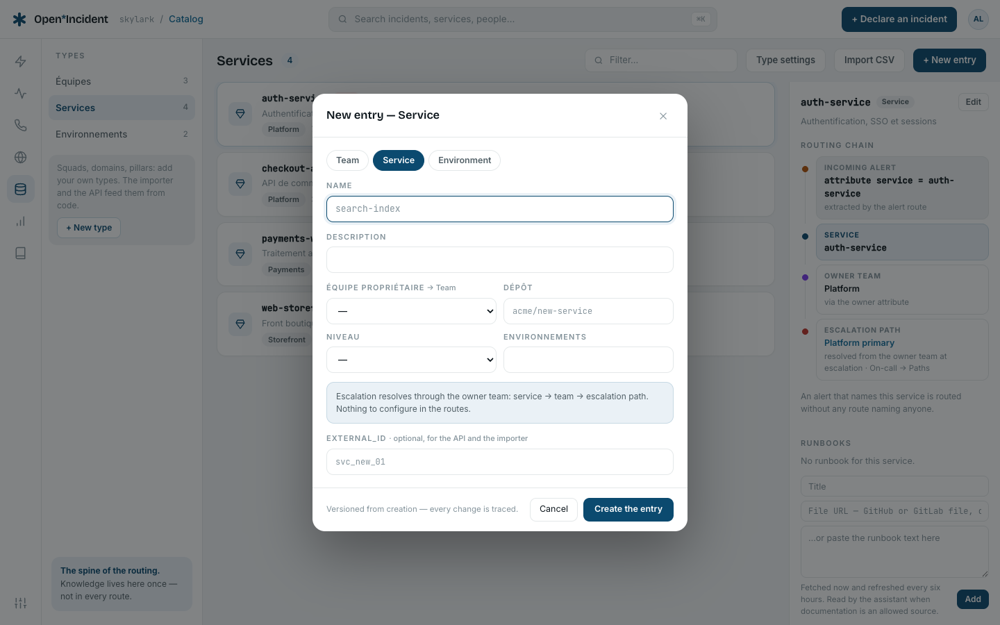
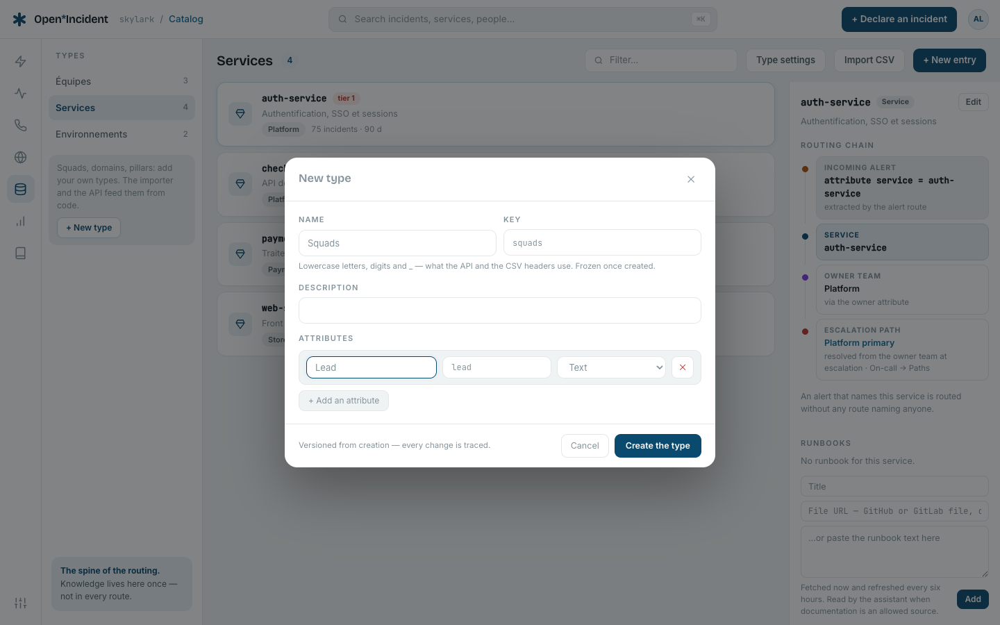
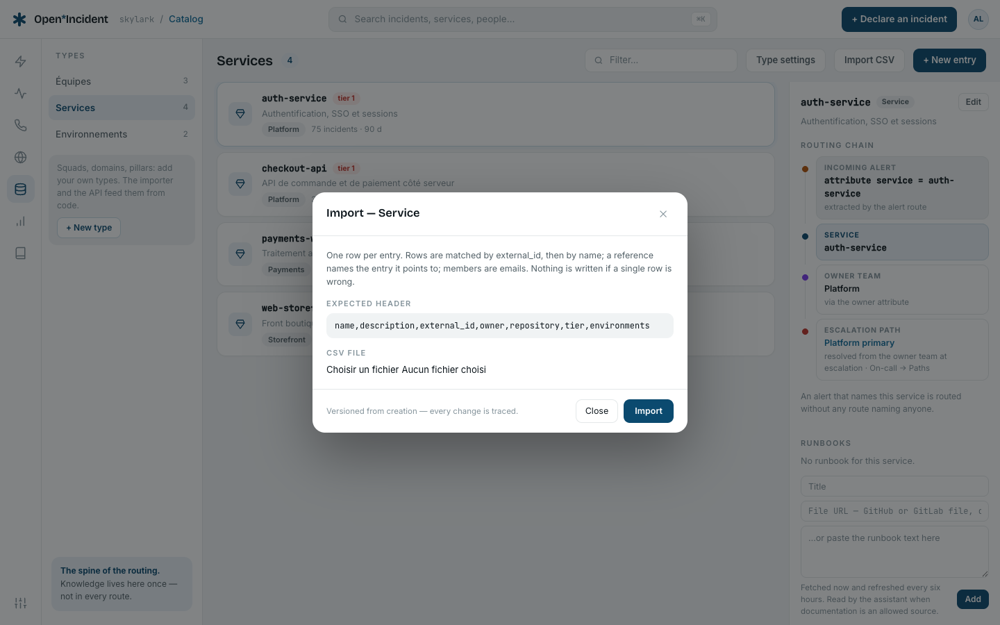

## What the catalog is for

The catalog is the spine of the routing: an alert names a service, the service names its owner team, the team names its escalation path — and nobody is named in a route. It is also what the rest of the product binds to: an incident's affected service, a status page's components, a follow-up's team, a heartbeat's service, the assistant's runbooks.


## Built-in types

| Type            | Attributes                                            | Used by                                                                        |
| --------------- | ----------------------------------------------------- | ------------------------------------------------------------------------------ |
| **Team**        | Members, escalation path, chat channel                | Service owners, follow-up assignees, SCIM groups                               |
| **Service**     | Owner team, repository, tier (tier 1–3), environments | Incidents, alerts, status page components, heartbeats, runbooks, change events |
| **Environment** | Paging (_pages_ or _silent_)                          | Alert attributes                                                               |

The three are built in: the routing reasons about them, so they can be extended with attributes but never deleted.

## Entries

Select a type, then **+ New entry**. The form is built from the type's attributes: a text, a link, a **choice** from the type's values, a **reference** to an entry of another type (a service's owner is a team), or **members** (emails). The optional `external_id` is the identifier the entry has in the system that owns it — what the importer and the API match on.



Selecting an entry shows, on the right:

- The **routing chain** for a service — _incoming alert → service → owner team → escalation path_ — with a link to the path.
- The **attributes** and the `external_id`.
- **Referenced by**: incidents over 90 days, services owned, follow-ups assigned, entries pointing here.
- For a service, its **runbooks** (see below).

**Edit** changes name, description, external_id and attributes. **Delete the entry** is refused while anything references it — incidents, incident field values, follow-ups, status page components, change events, heartbeats, runbooks, other entries — and the message lists the usages with examples. Remove the references first; nothing cascades.

## Runbooks

A service carries runbooks: **Runbooks → Title** plus either a **File URL** — a GitHub or GitLab file (fetched through the forge's API, with the workspace's tracker token when one is connected), or any text/markdown address — or pasted text. The file is fetched now and every six hours; a failed fetch keeps the last copy and says so. Runbooks are shown on the incident's side panel for the affected service, and quoted to the assistant only when **Runbooks and documents** is an allowed source in **Settings → AI governance**.

## Your own types

**+ New type** in the rail: a name, a key (derived from the name, lowercase letters, digits and `_`, frozen once created — it is what the API and the CSV headers use), a description, and attributes.



Attribute kinds:

| Kind              | Value                                                                          |
| ----------------- | ------------------------------------------------------------------------------ |
| **Text**          | Free text (500 characters).                                                    |
| **Link**          | An http(s) URL.                                                                |
| **Choice**        | One of the listed values.                                                      |
| **Catalog entry** | A reference to an entry of the chosen type — including the type being created. |
| **Members**       | A list of members.                                                             |

**Type settings** on a type renames it, changes its description and adds attributes. Removing an attribute that still holds values on entries is refused. **Delete the type** is possible when it has no entry and nothing references it (an incident field, another type's attribute).

## CSV import

**Import CSV** on a type (managers) shows the **expected header**: `name,description,external_id` then the type's attribute keys. One row per entry.

- Rows are matched by `external_id`, then by `name`; a match updates, otherwise a row creates.
- A reference names the entry it points to (its name, its `external_id` or its id); members are emails separated by `;`.
- A choice must be one of the type's values; a link must be an http(s) URL; an unknown column is an error.
- **Nothing is written while a single row is wrong**: the result lists every problem with its row number. Fix and import again.

The result reads _n created · n updated · n unchanged_.



## Managed by code

A type fed by the importer or the API can be **locked**: the rail shows _Managed by code_, and the screen offers neither creation, nor edition, nor import for it — the next import would undo a manual change. The lock is set by the importer's `--lock` flag or the API's `lock: true`.

## The importer CLI

The repository ships `catalog-importer`, a client of the public API: it needs an API key with the `write` scope and nothing else, and runs from anywhere — a laptop, CI, a cron.

```bash
# Backstage: groups → teams, components → services (owner, repository, tier)
pnpm catalog:import -- --source backstage --url http://backstage:7007 \
  --api https://acme.your-domain.example --key oi_live_…

# A catalog-info.yaml in a GitHub repository
pnpm catalog:import -- --source github --repo acme/platform --path catalog-info.yaml --ref main \
  --api … --key … [--token ghp_…]

# A local YAML/JSON bundle, locking the declared types
pnpm catalog:import -- --source local --file ./catalog.yaml --lock --api … --key …

# A CSV of one type
pnpm catalog:import -- --source local --file ./squads.csv --type squad --api … --key …

# The output of a command, or an inline document
pnpm catalog:import -- --source exec --cmd "./bin/export-catalog" --api … --key …
pnpm catalog:import -- --source inline --json '{"types":[…],"entries":[…]}' --api … --key …
```

`--dry-run` parses and prints without sending. `OI_API_URL`, `OI_API_KEY`, `GITHUB_TOKEN`, `BACKSTAGE_TOKEN` are read when the flags are absent.

A local or inline document is either Backstage entities (`kind: Group` / `kind: Component`, multi-document YAML accepted) or an Open Incident **bundle**:

```yaml
types:
  - key: squad
    name: Squads
    attributes:
      - { key: lead, label: Lead, type: text }
      - { key: domain, label: Domain, type: select, options: [payments, search] }
      - { key: team, label: Team, type: entry, refTypeKey: team }
entries:
  - {
      type: squad,
      name: Payments squad,
      external_id: sq_pay,
      attributes: { lead: Ana, domain: payments, team: Payments },
    }
```

The bundle is applied in one transaction: a single invalid item and nothing is written, every problem listed.

## The API

Everything the screen does, the API does with the same validation — see [API and automation](api):

- `GET /api/v1/catalog/types`, `POST /api/v1/catalog/types` (create or update a type by key; removing an attribute in use answers 409 unless `force`).
- `GET /api/v1/catalog/entries?type=service`, `POST /api/v1/catalog/entries` (one entry or a list, matched by `external_id` then `name`), `GET` and `DELETE /api/v1/catalog/entries/{id}` (409 with `referenced_by` while anything references the entry).
- `POST /api/v1/catalog/import` — a whole bundle with `lock` and `source`.

Every change, from the screen or the API, is a line in **Settings → Audit log**.
