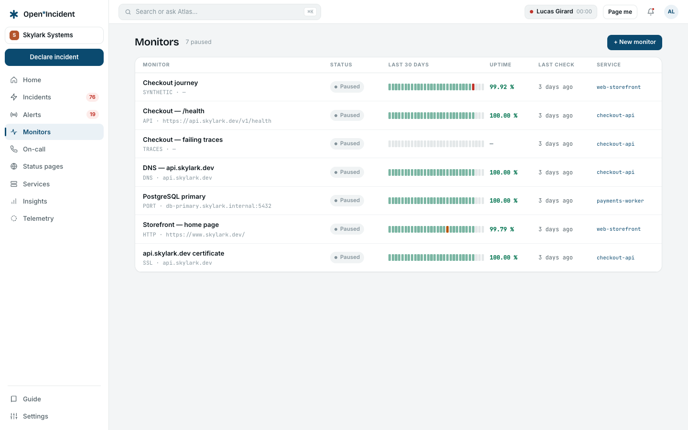
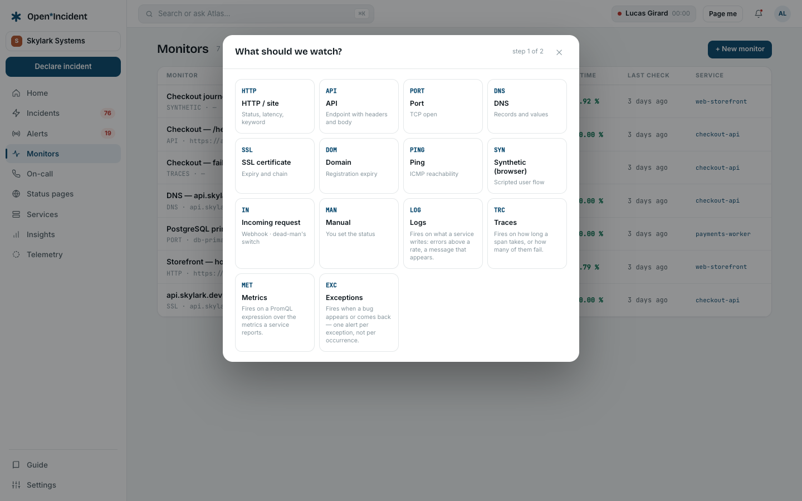
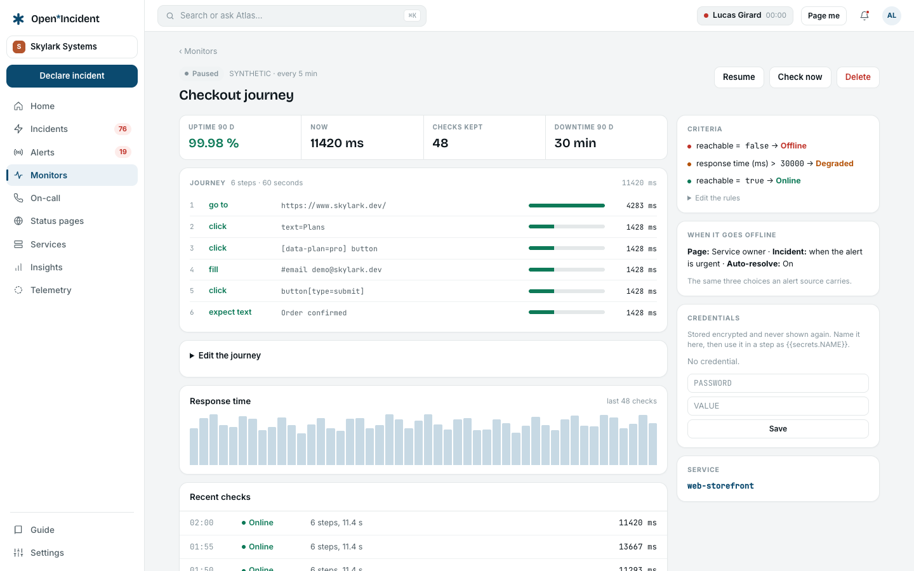

Every other chapter starts with something a monitoring tool sent you. This one is about the checks Open Incident runs on its own: a URL every minute, a certificate every hour, a scripted purchase every five minutes, a query over the logs your services already write.

The rule that makes them fit the rest of the product is worth stating before anything else: **a monitor never pages anybody directly.** When a monitor changes state, it posts an alert to the workspace's own ingest endpoint, through a managed source called **Monitors**, exactly as Datadog or Alertmanager would. Routing, priorities, grouping, escalation paths, incident creation and auto-resolution then behave as they do for any other alert — and everything you already configured under [Alerting settings](settings-alerting) applies without a second set of rules to keep in step.

## The list

**Monitors** shows one row per check: its name, its type and target in monospace, its state, **thirty days of bars**, the **uptime over ninety days**, when it was last checked and which service it belongs to. The coloured counts beside the title say how many are online, degraded, offline, waiting or paused.

Five states, and the fifth is the one that matters:

| State                       | Meaning                                                              |
| --------------------------- | -------------------------------------------------------------------- |
| **Online**                  | The last check satisfied the rules.                                  |
| **Degraded**                | It answered, but not well: slow, or a certificate about to expire.   |
| **Offline**                 | It did not answer, or answered with something the rules call broken. |
| **Paused**                  | Nothing is being checked. No alert can come from it.                 |
| **Waiting for first check** | Created, not yet run. Not a failure, and it pages nobody.            |

"Waiting" is its own state rather than an absence, because a monitor created a minute ago has not failed — it has not answered yet, and a screen that drew it as offline would page for nothing.

## Creating one

**+ New monitor** asks two questions, in two steps. The first is **what should we watch?** — a grid of fourteen types. The second is the monitor itself.

| Type                    | What it does                                     |
| ----------------------- | ------------------------------------------------ |
| **HTTP / site**         | Status, latency, keyword                         |
| **API**                 | An endpoint, with headers and a body             |
| **Port**                | A TCP port opens                                 |
| **DNS**                 | A record answers, with the value you expect      |
| **SSL certificate**     | Validity and expiry                              |
| **Domain**              | Registration expiry                              |
| **Ping**                | ICMP reachability                                |
| **Synthetic (browser)** | A scripted user flow in a real browser           |
| **Incoming request**    | A webhook that must arrive — a dead-man's switch |
| **Manual**              | You set the status yourself; nothing is checked  |
| **Logs**                | Fires on what a service writes                   |
| **Traces**              | Fires on how long a span takes, or how many fail |
| **Metrics**             | Fires on a PromQL expression                     |
| **Exceptions**          | Fires when a bug appears or comes back           |

A type this instance cannot run is still shown, greyed, with the reason in place of the hint — **Ping** without the `ping` binary in the worker image, **Synthetic** without a browser runner, the four telemetry types without a column store. The reason names the variable or the command that fixes it. Nothing is drawn that does nothing.

The second step asks for the **target** (or, for the types that reach out to nothing, a **name**), how **often** to check — one minute, five, fifteen or an hour — and the **service** it belongs to. That last field is the one people skip and should not: the service is how "page the owner" knows whom to wake, and it is what binds the monitor to a status page component later.

### What makes it online, degraded or offline

The form shows the rules the monitor will start with, as a sentence. An HTTP monitor starts with _200 in under 2 s → Online · slower → Degraded · unreachable or 4xx/5xx → Offline_. A certificate starts with _under 30 days → Degraded · under 7 days or invalid → Offline_. A ping with _slower than 500 ms → Degraded · 100 % packet loss → Offline_.

They are defaults, not decisions. The monitor's own page carries **Edit the rules** under the **Criteria** card: one line each, reading _what is measured · comparison · value · resulting state_, and they are **read top to bottom — the first rule that holds decides**. Clearing a value drops that rule. The two-second ceiling that makes a nightly batch "degraded" is exactly the number every team argues about, and arguing about it should not require recreating the monitor.

> One check decides. There is no "three failures in a row" for the types that reach out — a monitor that is offline is offline, and the retry you want is usually a longer interval or a looser rule. The telemetry types are the exception: they carry **held for**, counted in consecutive evaluations.

### The three choices

Three chip rows sit at the bottom of the form, and they are the same three an alert source carries:

- **Who to page** — **Service owner** (the default), **Me**, or **Nobody**.
- **Open an incident** — **Yes, in triage**, **When the alert is urgent** (the default), or **Never**.
- **Auto-resolve** — on by default: recovery resolves the alert and closes the escalation.

Leave them alone and nothing extra is created; the alert takes the workspace's ordinary road. Change any of them and the monitor gets a rule of its own, named **Monitor — <name>**, placed just above the catch-all so a rule you wrote by hand still wins. Deleting the monitor deletes that rule with it. The monitor's page reads the choices back **from the rule**, not from the monitor row, because the rule is what the next alert will obey.

## The monitor's own page

One screen, no tabs. Across the top: **uptime over 90 days**, the **latest latency**, how many checks are kept, and the **downtime over 90 days**. Then the **response time** chart over the last forty-eight checks, and the **recent checks** with their state, their detail line and their latency.

The buttons are **Pause**, **Check now** and **Delete**. **Check now** really runs the check, in-process, and shows you the answer — a monitor you cannot try is a monitor you do not trust. **Delete** takes effect immediately and takes the monitor's rule and its screenshots with it.

The sidebar carries the **Criteria** (with the editor), **When it goes offline** (the three choices, read back from the rule) and the **Service**.

Raw checks are kept for **thirty days**; the per-day rollup behind the bars and the uptime figures is kept longer, which is why a monitor shows ninety days of uptime and thirty days of bars.

## Browser journeys

A **synthetic** monitor plays a list of steps in a real browser, and each step is timed on its own. The editor is a table — **step**, **selector**, **value**, and a per-step timeout in seconds — with eight verbs: **go to**, **click**, **fill**, **select**, **wait for**, **expect text**, **expect url**, **expect status**. Up to thirty steps, and a **budget for the whole journey** of 30 s to 5 minutes.

The shortest interval this type accepts is **five minutes**, because a browser run is expensive and one every minute is a load test of your own site.

Credentials are named here and used in a step as `{{secrets.NAME}}`. They are stored encrypted and never shown again — not to you, not in an error message, which is redacted, and not in the screenshot, where password fields are painted over before the image is taken.

When a run fails, the monitor's page says **failed at step N**, names the step, shows the error and — if the instance has object storage configured — the screenshot at the moment it broke. That image is private: it is streamed to signed-in members of the workspace and never cached.

The journey runs in a separate process, started with `docker compose --profile synthetic up -d synthetic`. Without it the type is greyed on the creation form, and an existing journey says so in an amber banner on its own page rather than quietly not running.

## Monitors on your own telemetry

The last four types do not reach out to anything. They read what your services already send, and they exist because the most useful alert is often "the error rate on /checkout doubled", which no URL check can see. They need the [Telemetry](telemetry) module.

You write **which rows** — the same one-line filter language the explorer takes — then **measure** (how many, per second, average, median, 95th percentile…), **over** a window of one minute to an hour, and what makes it fire: **above a threshold**, or **away from the usual**. A metrics monitor takes a PromQL expression instead, and the series it returns are the series it watches.

Three options are worth reading twice:

- **Held for** — one run, or two, three or five in a row. This is how a one-minute spike stops waking anybody up. Recovery never waits.
- **One alert per** — a list of fields. Grouping splits the monitor: _errors by route_ pages about `/checkout` without dragging in `/health`, and each route resolves on its own. Leave it empty for a single alert.
- **When silent** — say nothing, **page (it stopped reporting)**, or read it as zero. A service that sent nothing is not a service that is fine, and which of the three is right depends on whether silence is normal for that query.

An **away from the usual** rule compares against the median of the same hour of the same weekday over the past four weeks, so a Monday morning is compared to other Monday mornings. A series with less than two weeks of history says **learning** and pages nobody.

The query is compiled when you save it, and a query that does not compile is refused by name with the reason — a bookmark to a failure is worse than no bookmark, and the moment to say so is while its author still remembers what they meant. A telemetry monitor's page lists **one row per series** it is watching, with what each one is doing: within range, breaching, stopped reporting, or learning.

The fastest way to create one is not this form at all: narrow the [explorer](telemetry) until it shows the thing you care about, then press **Watch**. The dialog opens on the second step with the query already in it, so the thing being alerted on is the thing you just looked at.

## Dead-man's switches: use heartbeats

A cron that stops running emits nothing, and nothing is exactly what no check can see. **Settings → Heartbeats** is the feature for it: each heartbeat has a URL, your job calls it when it finishes (any method, no body), and silence for longer than the interval plus the grace raises an alert through the workspace's **Heartbeats** source — same routes, same priorities, same escalation. The next ping resolves it, and nothing is alerted before the first ping ever arrives.

Rotating a heartbeat's token issues a new URL and stops the old one working at once.

> The **Incoming request** monitor type describes the same idea and is not finished: it has no URL to call. Use a heartbeat.

## On a status page

A status page **component** can track a monitor instead of being set by hand. It then takes its state, its uptime and its ninety bars from that monitor — online becomes _operational_, degraded becomes _degraded_, offline becomes _major outage_ — and neither a person nor a published incident overwrites them. See [Status pages](status-pages).

## In the API

`GET /api/v1/monitors` returns every monitor with its state, its last check, its latency and its service. There is no endpoint that creates one: a monitor carries a paging decision, and those are made in the product where the audit log sees them.

## What the demo workspace shows

The demo workspace ships **seven monitors, paused**, with ninety days of history behind them: an HTTP check, an API check, a certificate, a TCP port, a DNS record, a six-step browser journey, and a traces monitor grouped by route.

They are paused on purpose. Their targets are Skylark's, which is to say nobody's — `api.skylark.dev` does not resolve — so left running they would all go offline within the minute and page whoever the demo put on call, on a fresh install, before anybody had read a screen. A paused monitor keeps its bars, its uptime, its chart and its journey; what it does not do is reach out or wake anyone. Resume one and it becomes a real monitor of a target that is not there, which is its own first lesson.
