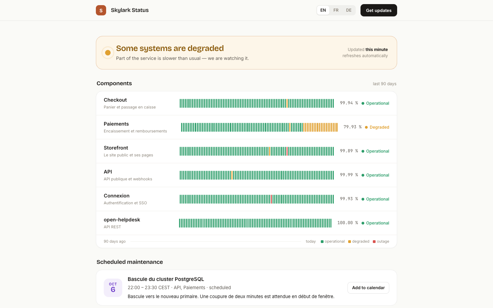
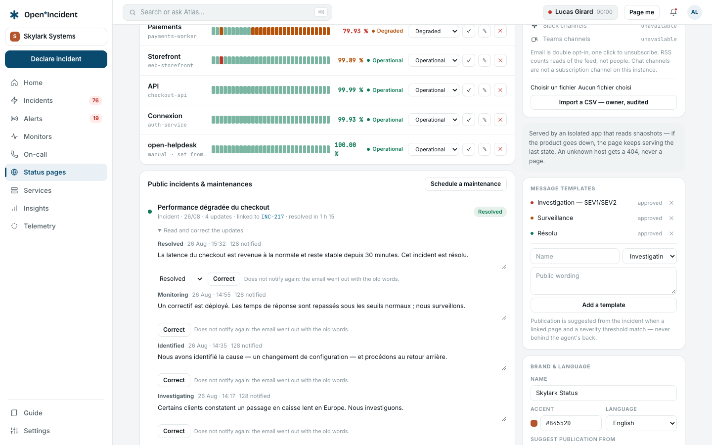

## Two applications

The public pages are served by a **separate, minimal application** (`status`, port 3001 in the compose stack) that reads one projection of the product and nothing else — no Redis, no session. If the product goes down, the last snapshot keeps being served. An unknown host answers 404, never a page.

Pages answer on `{slug}.<STATUS_BASE_DOMAIN>` at once (`skylark.status.localhost:3001` on the compose stack), and on a **custom domain** once its DNS is verified — from then on, every link to the page uses the custom domain. The demo workspace's `status.skylark.dev` stays _pending DNS_ on purpose: it is a sample, not a domain the instance serves.

## Creating and shaping a page

**Status pages → + New page** asks for an address (slug). The page is `noindex` until you launch it.

### Components

**+ Component** with a name, an optional group, and a **service** picked among the workspace's own. Bound to a service, the component is affected automatically when an incident on that service is published: the impact is derived from the incident's severity (degraded, partial outage, major outage). Each component shows 30-day bars and a 90-day uptime from the impact history.

### Visibility

**Public — anyone with the address**, or **Internal — members of the workspace only**. An internal page does not exist for anyone outside: 404 on the page and its feeds, no subscription form. A signed-in member opens it from the product (**View the public page →**) and receives a day's access through a signed token the status app verifies without a session or a database.

### Brand and language

Accent colour, language of the public wording (English, French, German), privacy policy and legal notice URLs, reply-to for subscriber emails. The workspace logo (uploaded in **Settings → General & brand**) is shown when object storage is configured.

### Publication threshold

**Suggest publication from SEV2 and above**: an incident at or above this severity, on a service bound to a component, shows _This incident meets the publication threshold of « page »_ on its page — and **nothing is published without you**. Below the threshold you can still publish from the update dialog.

### Domain

Enter the custom domain, point a CNAME at `status.<your domain>`, then **Save & verify DNS**. Once verified, your reverse proxy issues the certificate on first visit — it asks the status app whether the domain is one of yours before doing so (see [install](install)). **Indexing** switches from noindex to indexed when you launch.

### Templates

**Message templates** hold approved public wordings (_We are investigating elevated error rates on …_). They are suggested when publishing.

### Subscribers

Email subscribers with **double opt-in** and one-click unsubscribe; unlimited. An owner can **Import a CSV** — the import is audited.

## Publishing an incident

From the incident's **Share an update** dialog, tick **Status page — <page>** and choose the public status: **Investigating**, **Identified**, **Monitoring**, **Resolved**. The update's message is what subscribers and visitors read. Every later update offers the same tick; the components of the affected service take the impact derived from the severity; resolution clears it. The incident's details show **Published · Monitoring** with the number of public updates and notified subscribers, and the timeline says _Published on <page> — Investigating_.

### Correcting an update

A public update goes out to every subscriber the moment it is published, and some of them go out wrong: the service named is the wrong one, the time is off by an hour, a sentence says the opposite of what it meant.

Each published incident on the admin screen opens on its **public updates**, one form per update. Edit the text and press **Correct**. The newest update can also change its public status — **Investigating**, **Identified**, **Monitoring**, **Resolved** — and doing so moves the incident's public status with it; the older ones can only be reworded, because a timeline whose middle entries change status afterwards is a timeline nobody can read.

Two things a correction deliberately does not do. **It does not notify again**: the email went out with the old words, and a second one that says almost the same thing costs more trust than the mistake did. And **it does not hide itself** — the update carries _corrected at <time>_ on the public page and in the history, because a page that silently rewrites its own past is worth less than one that admits an edit.

## Maintenances

**Schedule a maintenance** with a title (the subject of the emails), a message, a period, and the components. Subscribers are told once at scheduling; with **automatic transitions**, the maintenance moves to _in progress_ at the start and _completed_ at the end without emailing anyone again. It appears on the page under **Maintenance in progress** and stays in the history for 90 days.

### Moving one

A window that has not started can move: the pencil beside a **scheduled** maintenance reopens the same form — title, message, dates, components — filled in.

Until this existed, the only way to move a window was to cancel it and schedule another, which tells every subscriber the maintenance was cancelled and then tells them about a new one, for what is the same maintenance.

Changing the **dates** adds one line to the public timeline, because a window nobody was told had moved is a window people will be surprised by. Rewording the **message** does not: the page already shows it. Nobody is emailed again either way. A maintenance that has started or finished is not edited — its own updates are the record of what happened, and moving the start of something that already started is a statement nobody can act on.

## Feeds and API

Every public page exposes **RSS** and **Atom** feeds, and the API lists pages and their public incidents (`GET /api/v1/status-pages`, `GET /api/v1/status-pages/{slug}/incidents`). Internal pages expose neither.
