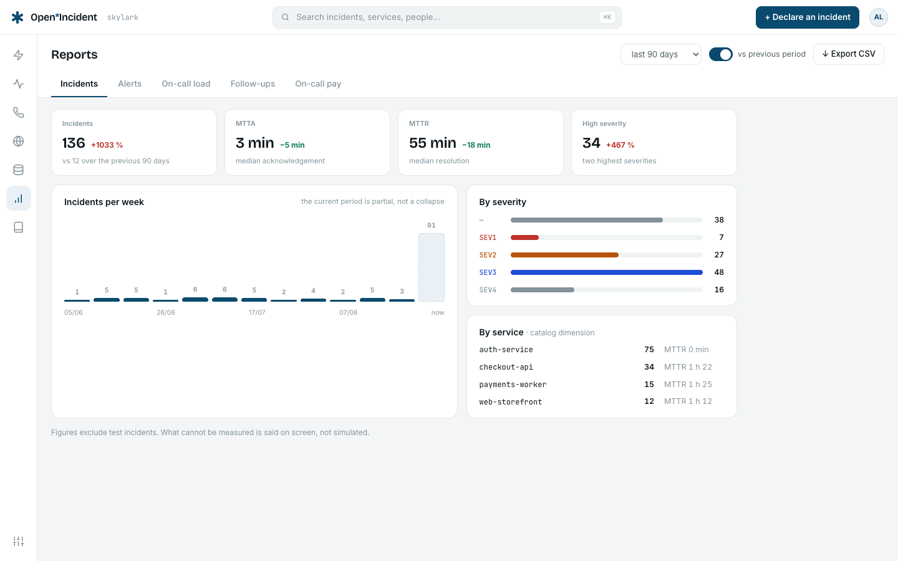
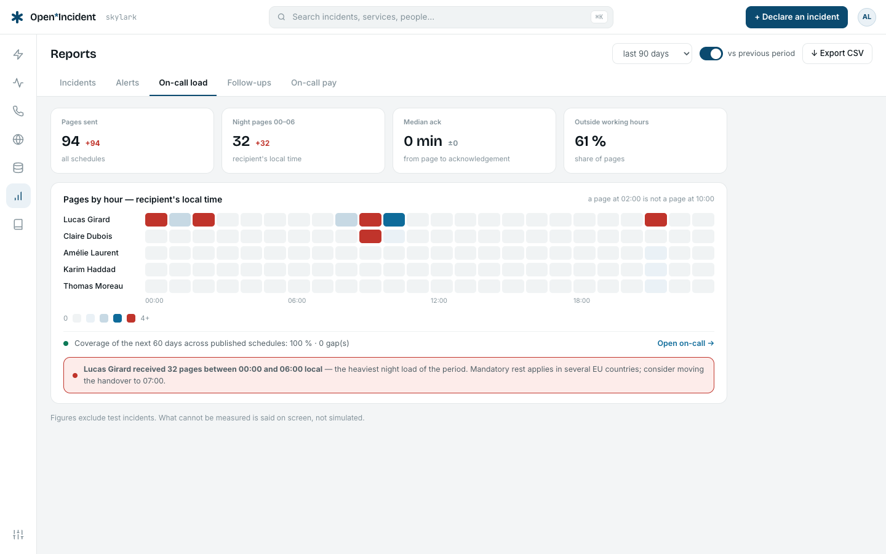
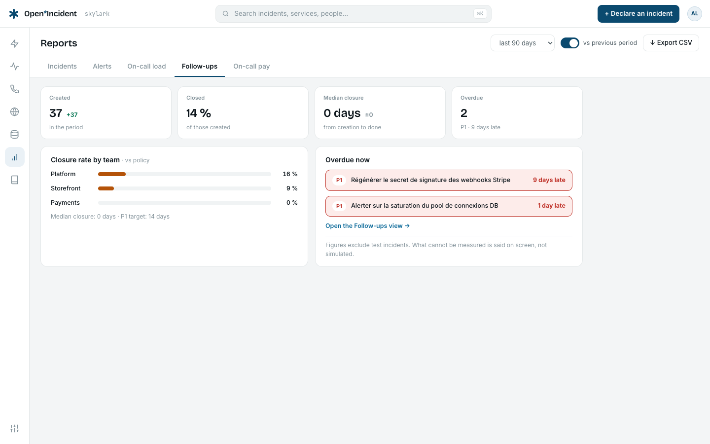

**Reports** answers the questions a team asks about itself. Pick a **Period** — the last 30, 90 or 365 days — and every figure is compared with the previous period of the same length. Test incidents are excluded everywhere. What cannot be measured is said on screen, not simulated. **Export CSV** exports the rows behind the current tab.

## Incidents

| Figure                             | Meaning                                                                           |
| ---------------------------------- | --------------------------------------------------------------------------------- |
| **Incidents**                      | Declared in the period, versus the previous period.                               |
| **High severity**                  | The two highest severities.                                                       |
| **Median acknowledgement**         | From detection to the first acknowledgement (TTA).                                |
| **Median resolution**              | From detection to resolution (TTR).                                               |
| **Incidents per week / per month** | The current period is partial — the chart says so rather than showing a collapse. |
| **By severity**, **By service**    | The service dimension comes from the catalog.                                     |

## Alerts

| Figure                     | Meaning                                                                                                                     |
| -------------------------- | --------------------------------------------------------------------------------------------------------------------------- |
| **Alerts**                 | After grouping and deduplication.                                                                                           |
| **Active sources**         | Receiving right now.                                                                                                        |
| **Auto-resolved < 5 min**  | The noise indicator: alerts that resolve themselves in under five minutes are candidates for grouping or higher thresholds. |
| **Alert → incident**       | Conversion rate.                                                                                                            |
| **Alert volume by source** | Where the noise comes from.                                                                                                 |
| **Recurring alerts**       | The noise radar, with **Adjust the route** and **Open the alert** shortcuts.                                                |

## On-call load

| Figure                    | Meaning                                                                                                                                                                                                    |
| ------------------------- | ---------------------------------------------------------------------------------------------------------------------------------------------------------------------------------------------------------- |
| **Pages sent**            | Across all schedules.                                                                                                                                                                                      |
| **Median ack**            | From page to acknowledgement.                                                                                                                                                                              |
| **Night pages 00–06**     | In the recipient's local time. When one person carried the heaviest night load, a banner names them and the count — mandatory rest applies in several EU countries; consider moving the handover to 07:00. |
| **Outside working hours** | Share of pages.                                                                                                                                                                                            |
| **Pages by hour**         | A heat strip in the recipient's local time: a page at 02:00 is not a page at 10:00.                                                                                                                        |
| **Coverage**              | Of the next 60 days across published schedules, with the number of gaps and a link to on-call.                                                                                                             |

## Follow-ups

| Figure                   | Meaning                                                                     |
| ------------------------ | --------------------------------------------------------------------------- |
| **Created**, **Closed**  | In the period.                                                              |
| **Median closure**       | From creation to done, against the P1 policy.                               |
| **Closure rate by team** | Teams come from the catalog's service owners.                               |
| **Overdue now**          | With the priority and the days late, and a link to the **Follow-ups** view. |

## On-call pay

The fifth tab holds the pay rules and the monthly reports — described in [On-call](on-call#on-call-pay). The tab's CSV export takes a `period=YYYY-MM` parameter.
