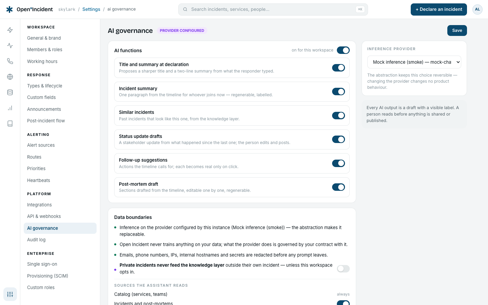

## The principle

The assistant **proposes and never publishes**. Every output is a draft with a visible **AI DRAFT** label; a person reads it before anything is shared, sent or published. It reads the incident's own timeline first, then the sources the workspace allows.

It exists only when the operator configured an inference provider on the instance (`AI_API_BASE`, `AI_MODEL` — any OpenAI-compatible endpoint: Mistral La Plateforme, an EU-region deployment, a self-hosted Ollama or vLLM). Without it, every assistant function is shown as unavailable; nothing is simulated.

## What it does

| Capability                           | Where                     | What you get                                                                                                                                 |
| ------------------------------------ | ------------------------- | -------------------------------------------------------------------------------------------------------------------------------------------- |
| **Title and summary at declaration** | The declaration form      | **Propose a title and summary** drafts both from what you typed.                                                                             |
| **Incident summary**                 | The incident's side panel | One paragraph from the timeline for whoever joins now; **Regenerate** at will; the generation time is shown.                                 |
| **Similar incidents**                | The side panel            | Past incidents that look like this one — _by meaning_ when an embedding model is configured, _by title_ otherwise, and the panel says which. |
| **Status update drafts**             | The update dialog         | **Draft with AI** writes the stakeholder update from what happened since the last one.                                                       |
| **Follow-up suggestions**            | The follow-ups tab        | **Suggest follow-ups** proposes actions the timeline calls for; each becomes real only when you click **Create**.                            |
| **Post-mortem draft**                | The post-incident tab     | Six sections drafted from the timeline, editable one by one, regenerable one by one.                                                         |

The side panel also shows the affected service's **Runbooks** and the **Recent changes** (deploys, flags, config changes posted through `POST /api/v1/change-events` in the day before the incident and until its resolution) — both are read by the assistant when allowed.

## Governance

**Settings → AI governance** decides, per workspace:

- The **master switch** — on or off for this workspace.
- Each **AI function** — a switch per capability above.
- The **sources the assistant reads**: incidents and post-mortems (always), the catalog (services, teams), change events, and **Runbooks and documents** (off by default).
- Whether **private incidents feed the knowledge layer** outside their own incident (off by default).

### Data boundaries, stated on screen

- Inference runs on the provider configured by this instance, named on the screen; the abstraction makes it replaceable without changing the product's behaviour.
- **Emails, phone numbers, IPs, internal hostnames and secrets are redacted** before any prompt leaves the instance.
- Open Incident never trains anything on your data; what the provider does is governed by your contract with it.

### The call log

Every call is logged: who made it, on which incident, which capability, which model, how many tokens, how long. The log is on the same screen.

## Refusals you may see

| Message                                                              | Cause                                                 |
| -------------------------------------------------------------------- | ----------------------------------------------------- |
| _No inference provider is configured on this instance._              | The operator has not set `AI_API_BASE` / `AI_MODEL`.  |
| _AI functions are switched off for this workspace._                  | The master switch.                                    |
| _This AI function is switched off in the workspace's AI governance._ | The capability's own switch.                          |
| _The assistant did not answer. Nothing was written; try again._      | The provider failed or timed out; no draft was saved. |
