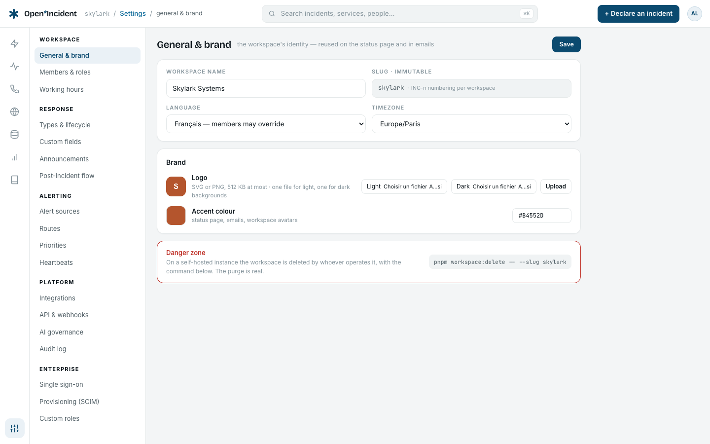
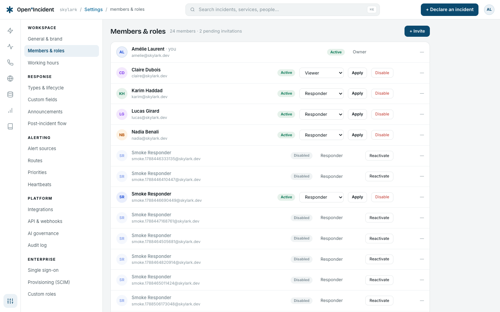
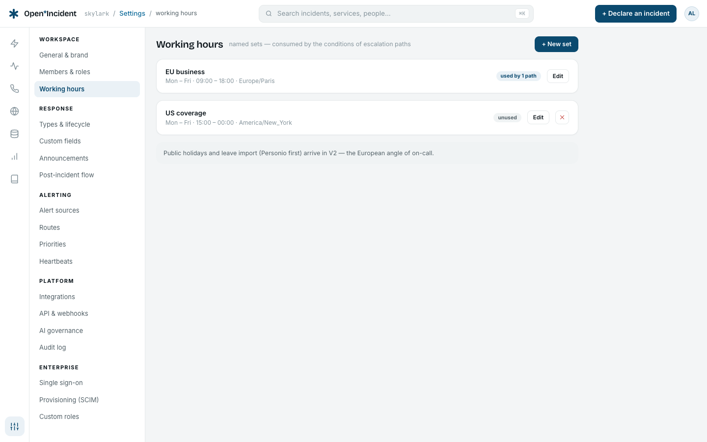

The **Settings** section is reserved to members who hold at least one settings permission — owners and admins with the built-in roles. The left navigation shows the screens the member holds; a viewer or responder who lands here by URL reads why, and no form is rendered.

## General & brand

| Setting            | Notes                                                                                                                                                                                                                                                                                            |
| ------------------ | ------------------------------------------------------------------------------------------------------------------------------------------------------------------------------------------------------------------------------------------------------------------------------------------------ |
| **Workspace name** | Reused on the status page and in emails.                                                                                                                                                                                                                                                         |
| **Slug**           | Immutable — it is the subdomain. Incidents are numbered `INC-n` per workspace.                                                                                                                                                                                                                   |
| **Language**       | English, French or German; members may override in their account.                                                                                                                                                                                                                                |
| **Timezone**       | Default for members; schedules carry their own.                                                                                                                                                                                                                                                  |
| **Logo**           | SVG or PNG, 512 KB at most, one file for light and one for dark backgrounds. Stored in the instance's object storage under the workspace's own prefix and served with a sandboxing policy, so an uploaded SVG can never run script. _Unavailable on this instance_ when no `S3_*` is configured. |
| **Accent colour**  | Status page, emails, workspace avatars.                                                                                                                                                                                                                                                          |
| **Danger zone**    | On a self-hosted instance the workspace is deleted by the operator with `pnpm workspace:purge` — the purge is real and verified (see [Operations](operations)).                                                                                                                                  |

## Members & roles

- **+ Invite** takes a list of addresses and a shared role; each receives a link valid for seven days. An address that is already a member is skipped.
- The **role select** on a row saves on change: **Owner** (only an owner appoints one), **Admin**, **Responder**, **Viewer** — and the workspace's custom roles when the enterprise edition is entitled, shown as _Name · base_. You cannot change your own role.
- **Disable** refuses the member at the door from then on; what they did stays attributed. **Reactivate** reverses it.
- Pending invitations can be **resent** or **revoked**.

Members created by single sign-on or SCIM appear here like the others, with their source recorded. What each role may do is in [Concepts](concepts#roles-and-permissions); custom roles in [Custom roles](custom-roles).

## Working hours

Named sets — _EU business: Mon–Fri 09:00–18:00_, _US coverage_ — consumed by the **conditions** and **delays** of escalation paths (_Working hours "EU business"?_, _Wait until "EU business" opens_). An end at 00:00 means midnight; an end before the start wraps past midnight. Each set shows how many paths use it.
