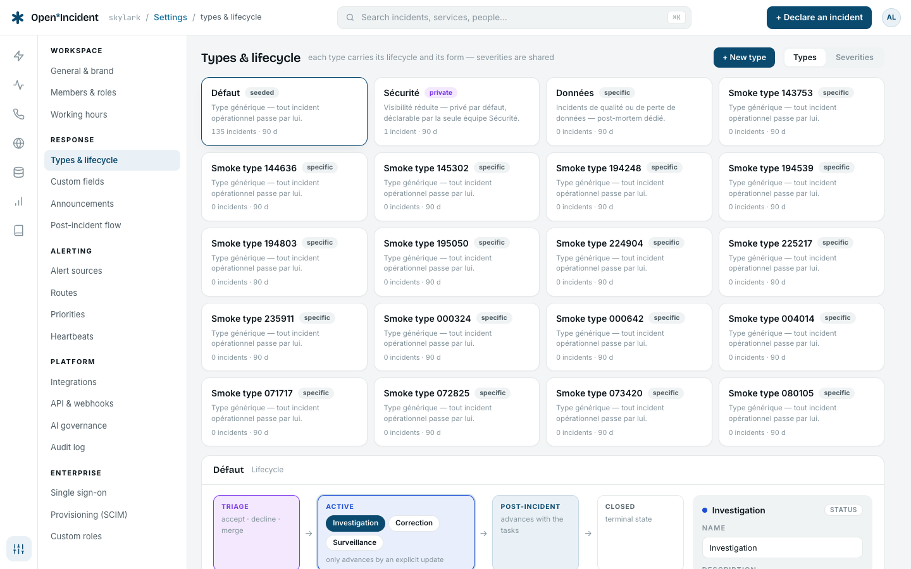
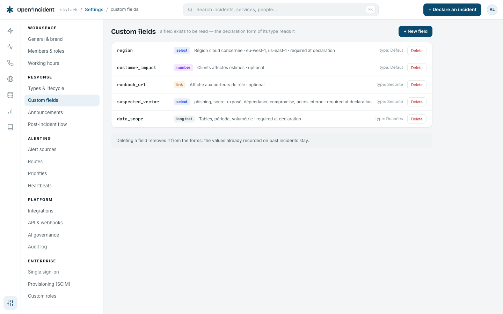
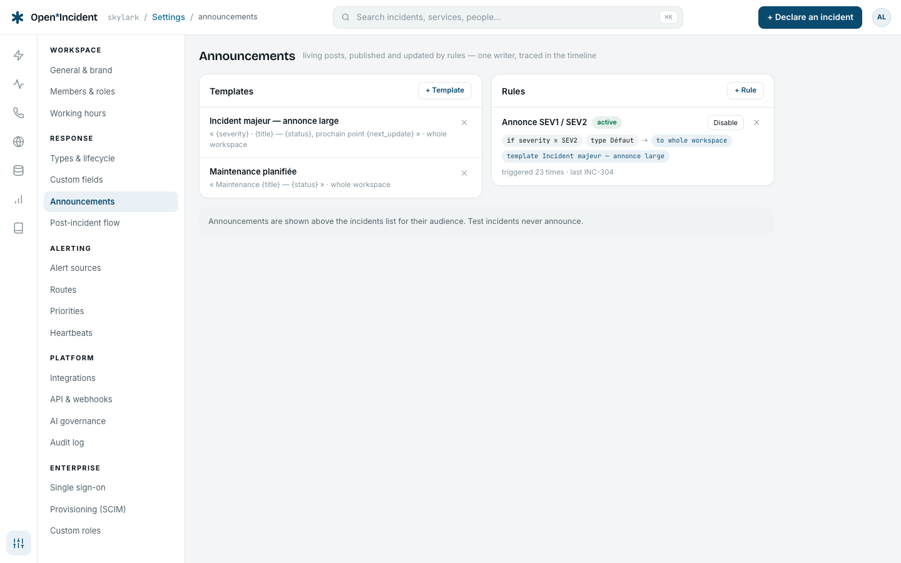
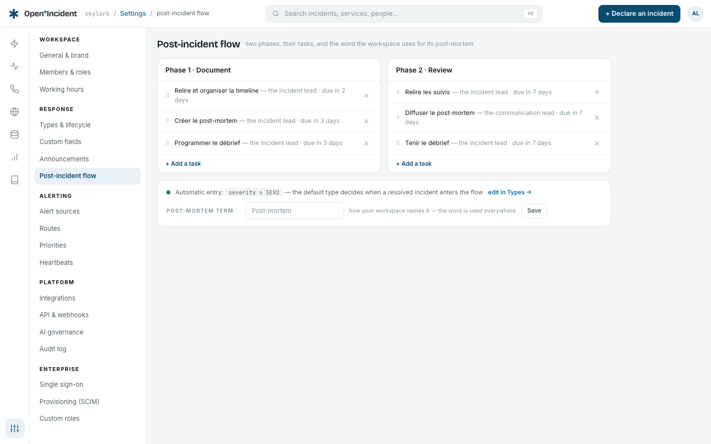

## Types & lifecycle

Each **incident type** carries its own lifecycle and its own declaration form; **severities** are shared by every type.

### The lifecycle

Four phases, drawn in order. Click a phase or a status to configure it — every transition is a timeline event, never a silent change.

| Phase             | Configuration                                                                                                                                                                                                                                                                                |
| ----------------- | -------------------------------------------------------------------------------------------------------------------------------------------------------------------------------------------------------------------------------------------------------------------------------------------- |
| **Triage**        | Entry point of incidents created by an alert or the API; nobody is paged until a responder decides. Possible actions: accept, decline, merge.                                                                                                                                                |
| **Active**        | The type's statuses, in order: a name, a description, an **update reminder** (the default delay before the next update is due), the **public status** it maps to on status pages (or _not published_), and whether it **counts in the MTTR**. The phase only advances by an explicit update. |
| **Post-incident** | Entered _always_, _never_, or from a severity; advances as the flow's tasks complete; leaves when every task is done or skipped with a reason.                                                                                                                                               |
| **Closed**        | Terminal. Reopening possible for 30 days.                                                                                                                                                                                                                                                    |

### The declaration form

Title, severity, affected service and summary are system fields, each required or optional. Custom fields of the type (or of every type) follow. A type may be **declarable by everyone** or by **one team only**, and may start its incidents **private**.

### New types

**+ New type** inherits the lifecycle and form of the type it is based on — adjust afterwards. Seeded types are marked; restricted and private types carry a badge.

### Severities

Ordered and shared. Each carries a description, a colour, and the **post-incident entry** rule: _always_, _yes_, _opt-in at closure_, _no_. Changing a severity on an incident is a timeline event.

> Severity ≠ priority ≠ urgency. Severity qualifies the incident; priority qualifies the alert; urgency picks the notification channel.

## Custom fields

A field exists to be read: the declaration form of its type reads it, the incident shows it, the API and the webhook payloads carry it under `custom_fields`.

- **API name**: lowercase letters, digits and underscores (`region`, `customer_impact`).
- **Type**: text, long text, select (options one per line), number, link, **catalog** (a reference to entries of a catalog type — a squad, a region, a customer).
- **Incident type**: one type, or all types.
- **Required at declaration** or optional.

Deleting a field removes it from the forms; the values already recorded on past incidents stay.

## Announcements

Announcements are **living posts**: a rule publishes one when an active incident matches, keeps it updated at every status update and closes it at resolution. They are shown above the incidents list for their audience; with Slack or Teams connected, in the announcement channel as well. Test incidents never announce.

- **Templates**: a name, an **audience** (whole workspace, owning team, role holders), a body with variables `{severity}`, `{title}`, `{status}`, `{next_update}`, `{reference}`, `{service}`, `{lead}`, `{summary}` — re-rendered at every update.
- **Rules**: _if severity ≥ SEV2_ and optionally _type = …_, _then publish template …_. Each rule shows how many times it triggered and the last incident.

## Post-incident flow

Two phases — **Document**, **Review** — and their tasks: a title, a phase, a default assignee (the incident lead, the communication lead, nobody), a deadline in days after entering the phase. A new task applies to incidents entering the flow from now on.

The **post-mortem term** is the word the workspace uses — _post-mortem_, _retro_, _RCA_ — everywhere the product names it. The automatic entry into the flow is decided per severity, in **Types & lifecycle**.
