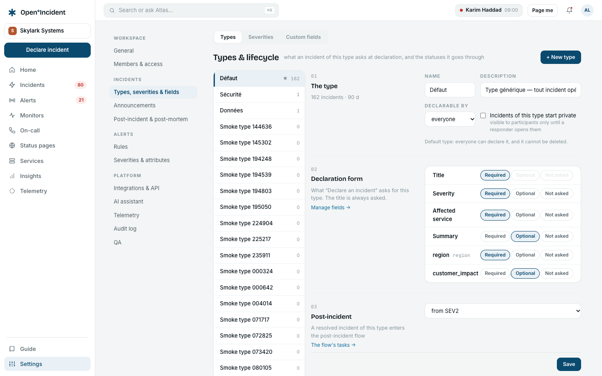
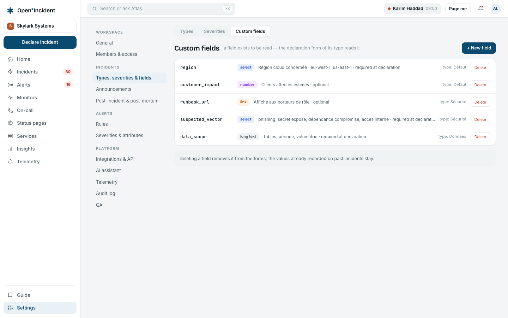
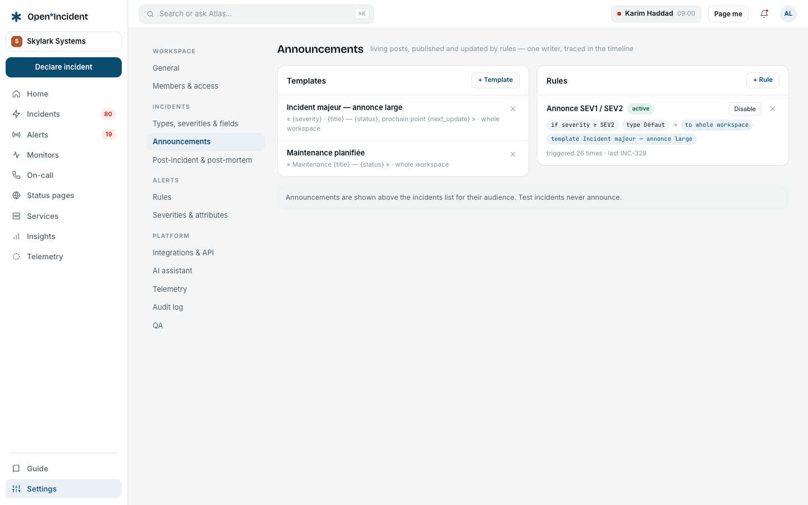
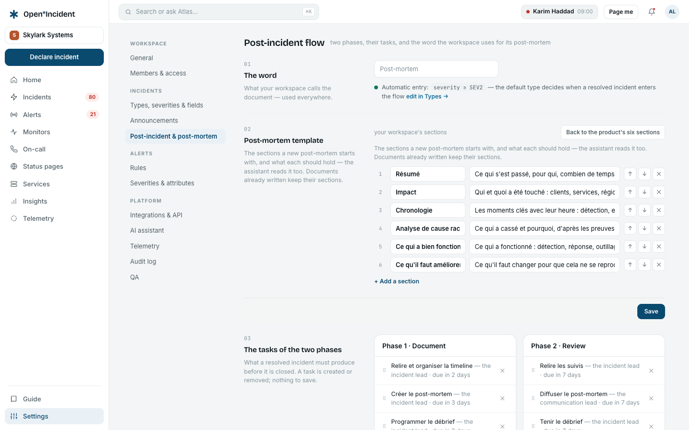

## Types, severities & fields

One entry, three tabs. Each **incident type** carries its own lifecycle and its own declaration form; **severities** are shared by every type; **custom fields** are what a type's form asks beyond the system fields.

### A type's sheet

Pick a type in the list on the left; the sheet on the right reads top to bottom in four numbered sections. The first three — the type, its declaration form, its post-incident rule — are one form with one **Save**, which stays in view at the bottom while you edit. The statuses come last and are a list of their own: a status is added, moved or removed on the spot, nothing to save.

| Section              | What you decide                                                                                                                                                                                                                                                                                                                                                          |
| -------------------- | ------------------------------------------------------------------------------------------------------------------------------------------------------------------------------------------------------------------------------------------------------------------------------------------------------------------------------------------------------------------------ |
| **The type**         | Name, description, **who may declare it** (everyone, or one team), and whether its incidents **start private**. The default type is everyone's and cannot be deleted; another type can be deleted as long as no incident carries it — the sheet says how many do.                                                                                                        |
| **Declaration form** | One choice per field — **Required**, **Optional**, **Not asked** — for the system fields (severity, affected service, summary; the title is always asked) and for the custom fields of this type or of every type. **Manage fields →** adds or removes custom fields.                                                                                                    |
| **Statuses**         | The statuses an active incident goes through, **in order**: an accepted incident starts at the first and only advances by an explicit update. Each has a name, a description, an **update reminder**, the **public status** it maps to on status pages, and whether it **counts in the MTTR**. Reorder with the arrows; a status with incidents in it cannot be deleted. |
| **Post-incident**    | When a resolved incident of this type enters the post-incident flow: _never_, _always_, or _from_ a severity.                                                                                                                                                                                                                                                            |

Around the statuses, three phases are the same for every type and are not configured here: **Triage** before (incidents created by an alert or the API wait there until a responder accepts, declines or merges them), **Post-incident** after (advances as the flow's tasks complete), and **Closed** (terminal; reopening possible for 30 days). Every transition is a timeline event, never a silent change.

### Severities

Ordered and shared. Each carries a description, a colour, and the **post-incident entry** rule: _always_, _yes_, _opt-in at closure_, _no_. Changing a severity on an incident is a timeline event.

> Severity ≠ priority ≠ urgency. Severity qualifies the incident; priority qualifies the alert; urgency picks the notification channel.

### Custom fields

A field exists to be read: the declaration form of its type reads it, the incident shows it, the API and the webhook payloads carry it under `custom_fields`.

- **API name**: lowercase letters, digits and underscores (`region`, `customer_impact`).
- **Type**: text, long text, select (options one per line), number, link.
- **Incident type**: one type, or all types.
- **Required at declaration** or optional.

Deleting a field removes it from the forms; the values already recorded on past incidents stay.

## Announcements

Announcements are **living posts**: a rule publishes one when an active incident matches, keeps it updated at every status update and closes it at resolution. They are shown above the incidents list for their audience; with Slack or Teams connected, in the announcement channel as well. Test incidents never announce.

- **Templates**: a name, an **audience** (whole workspace, owning team, role holders), a body with variables `{severity}`, `{title}`, `{status}`, `{next_update}`, `{reference}`, `{service}`, `{lead}`, `{summary}` — re-rendered at every update.
- **Rules**: _if severity ≥ SEV2_ and optionally _type = …_, _then publish template …_. Each rule shows how many times it triggered and the last incident.

## Post-incident flow

Two phases — **Document**, **Review** — and their tasks: a title, a phase, a default assignee (the incident lead, the communication lead, nobody), a deadline in days after entering the phase. A new task applies to incidents entering the flow from now on.

The **post-mortem term** is the word the workspace uses — _post-mortem_, _retro_, _RCA_ — everywhere the product names it. The automatic entry into the flow is decided per severity, in **Types & lifecycle**.
