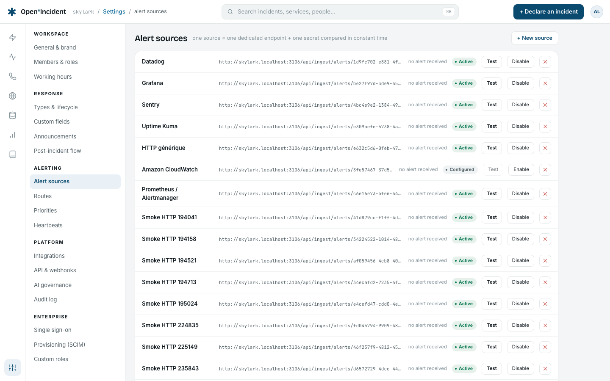
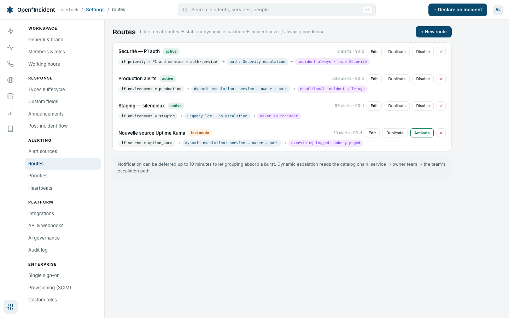
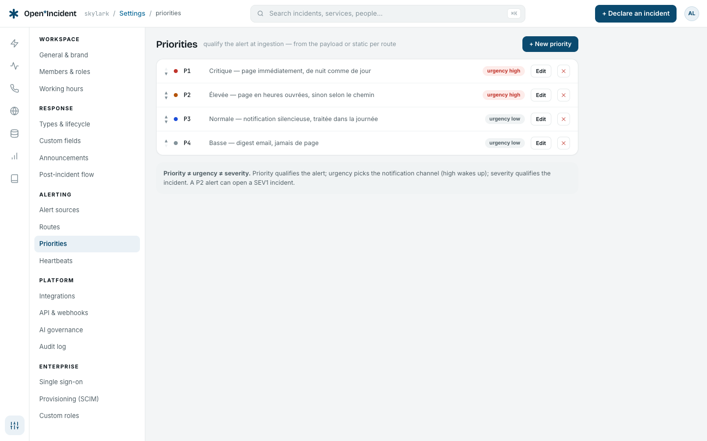
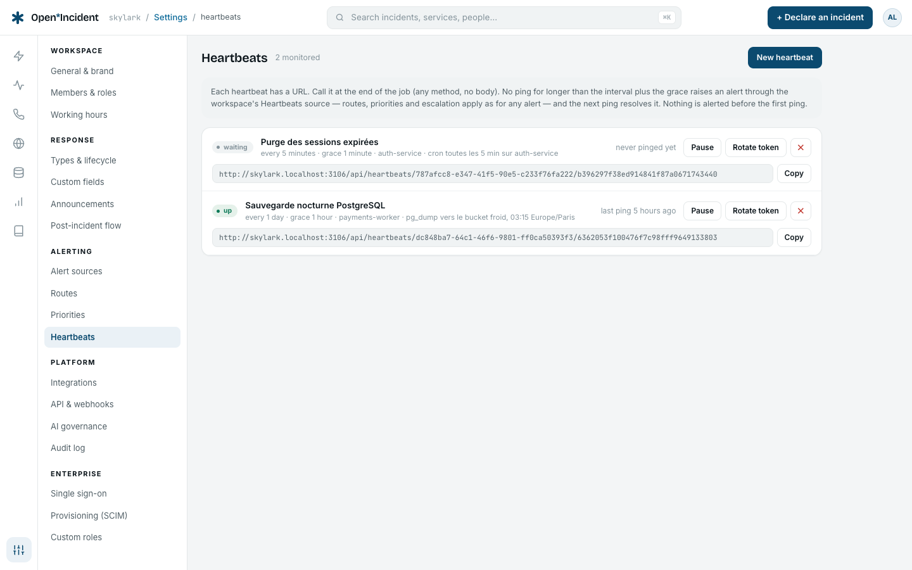

## Alert sources

One source = one dedicated endpoint + one secret compared in constant time. **+ New source** picks the **tool** and a name; the endpoint and the secret are shown once — paste them into the tool's webhook notifications. The secret travels as the `x-oi-secret` header or the `?secret=` query parameter. Only its SHA-256 is stored: create a new source if you lose it.

The **Test** button sends a real alert end to end in test mode — logged and routed, nobody paged, no incident — and links to it.

### Per tool

| Tool                          | In the tool                                                                                                                                                      | How the payload is read                                                                                                                                                                                                                                                        |
| ----------------------------- | ---------------------------------------------------------------------------------------------------------------------------------------------------------------- | ------------------------------------------------------------------------------------------------------------------------------------------------------------------------------------------------------------------------------------------------------------------------------ |
| **Datadog**                   | Integrations → Webhooks: a webhook with the endpoint URL and a custom header `x-oi-secret`; attach it to the monitors' notifications (`@webhook-open-incident`). | Title from `title` / `event_title`, body from `body`; the monitor's `scope` (`env:prod,service:checkout-api`) becomes attributes (`env` → `environment`); `priority` kept; deduplicated by `monitor_id` (or `alert_id`); a _Recovered_ / _OK_ transition resolves.             |
| **Prometheus / Alertmanager** | A `webhook_configs` receiver with the endpoint URL and `?secret=` in it.                                                                                         | One alert per entry of the batch; labels become attributes; deduplicated by the fingerprint; `status: resolved` resolves.                                                                                                                                                      |
| **Grafana**                   | A contact point of type Webhook with the URL and the secret in a header.                                                                                         | Same as Alertmanager (Grafana sends the same shape), deduplicated by the rule id; annotations land in the description.                                                                                                                                                         |
| **Sentry**                    | Project → Alerts → an alert rule with a webhook action (or the Webhooks integration) to the URL with the secret.                                                 | Issue title and culprit; the issue's tags become attributes (`env` → `environment`); deduplicated by the issue id; the _resolved_ action resolves; link back to the issue.                                                                                                     |
| **CloudWatch**                | An SNS topic subscribed by HTTPS to the endpoint (the secret in the URL); alarms notify the topic.                                                               | The alarm inside the SNS envelope: `AlarmName` as title, `NewStateReason` as description, `Region` as attribute; deduplicated by the alarm ARN; `OK` resolves.                                                                                                                 |
| **Uptime Kuma**               | A Webhook notification with the URL; the secret in a custom header.                                                                                              | Monitor name and URL; the monitor name is the `service` attribute; up resolves, down fires; deduplicated by the monitor id.                                                                                                                                                    |
| **Generic HTTP**              | Any tool that can post JSON.                                                                                                                                     | Free schema: `title`, `description`, a `dedup_key` / `fingerprint` / `id` as deduplication key (a hash of the payload otherwise), a status field matching _resolved / ok / recovered / closed / up_ resolves; every string field becomes an attribute the mappings can rename. |
| **Inbound email**             | One dedicated address per source.                                                                                                                                | The subject becomes the title.                                                                                                                                                                                                                                                 |

The payload is stored raw as JSON and parsed downstream; the source's **mappings** rename or extract attributes on top of the parser's output (`labels.team` → `team`).

Adding a dedicated tool is a schema plus a mapping, not a connector — that is how the long tail is covered.

## Routes

Routes are tried **in order**; the first whose filters all match wins. No route matching means the alert is logged and nobody is paged.

### Filters

_All must match_: `attribute op value`, where op is **equals**, **not equals**, **in** (a list) or **exists**. Attributes are what the mappings extract: `environment`, `service`, `team`, `priority`, `source`, `region`… A route with no filter matches every alert.

### Escalation

| Mode                                          | Behaviour                                                                                                               |
| --------------------------------------------- | ----------------------------------------------------------------------------------------------------------------------- |
| **Dynamic — service → owner team → its path** | Reads the catalog chain from the alert's `service` attribute. A **fallback path** applies when the chain is incomplete. |
| **Static — one path**                         | Always the chosen path.                                                                                                 |
| **None — log only**                           | Recorded, nobody paged.                                                                                                 |

### Incident

| Rule                                          | Behaviour                                                                  |
| --------------------------------------------- | -------------------------------------------------------------------------- |
| **Never**                                     | The alert stays an alert.                                                  |
| **Always — opens active**                     | An incident of the **default type** opens in the active phase at once.     |
| **Conditional — triage when urgency is high** | An incident is created in triage; a responder accepts, declines or merges. |

### Priority, urgency, deferral, test mode

- **Priority**: _from the payload_ (the mapping's `priority` attribute matched against the workspace's priorities) or a fixed one.
- **Urgency**: _from the priority_ (each priority carries one) or fixed. High wakes people up; low stays silent.
- **Defer notification** up to 10 minutes lets grouping absorb a burst before anyone is paged.
- **A resolution from the source ends the escalation**: tick to stop paging when the tool says the problem is gone.
- **Test mode**: everything logged, nobody paged, no incident — the way to verify a filter. **Duplicate** creates a copy in test mode to try a change without touching the live route.

## Priorities

Priorities qualify the alert at ingestion — from the payload or static per route. Each has a name (P1…), a description, a **colour**, and an **urgency**: _high — wakes up_ or _low — silent_. Priority ≠ urgency ≠ severity: a P2 alert can open a SEV1 incident.

## Heartbeats

A cron that stops pinging is an alert. **New heartbeat**: a name, an optional description, the **service** it belongs to, **Expected every** (interval, at least ten seconds) and a **Grace**. The row shows the URL to call at the end of the job — any method, no body.

- Silence beyond the interval plus the grace raises an alert through the workspace's own managed **Heartbeats** source, posted to the public ingest endpoint like any monitoring tool — routes, priorities, grouping and escalation apply unchanged. The next ping resolves it.
- Nothing is alerted before the first ping; the state reads _waiting_, then _up_ or _down_.
- **Pause** during a planned stop: pausing forgets the last ping, so resuming waits for a fresh one. **Rotate token** issues a new URL; the old one stops working at once.

The worker sweeps heartbeats every thirty seconds.
