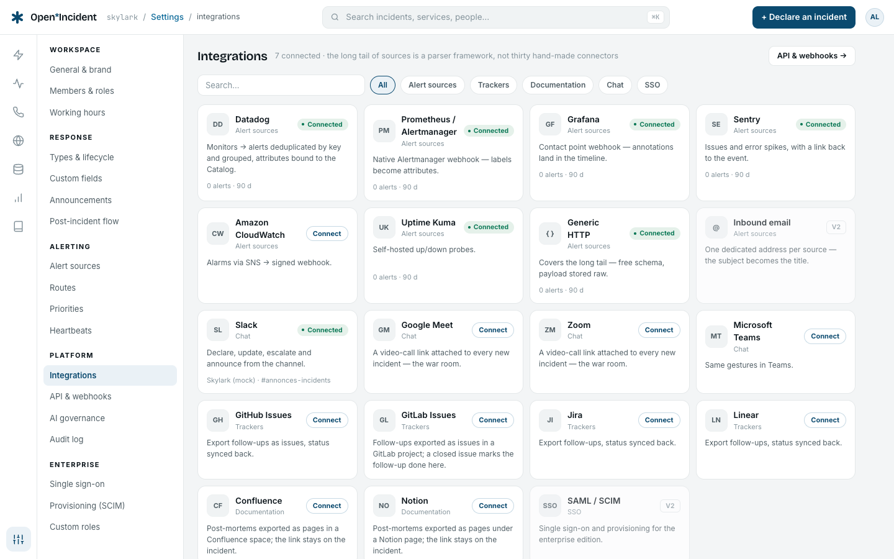
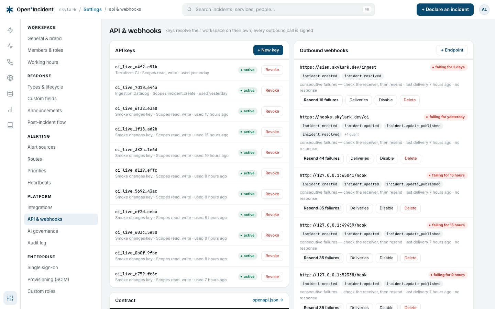
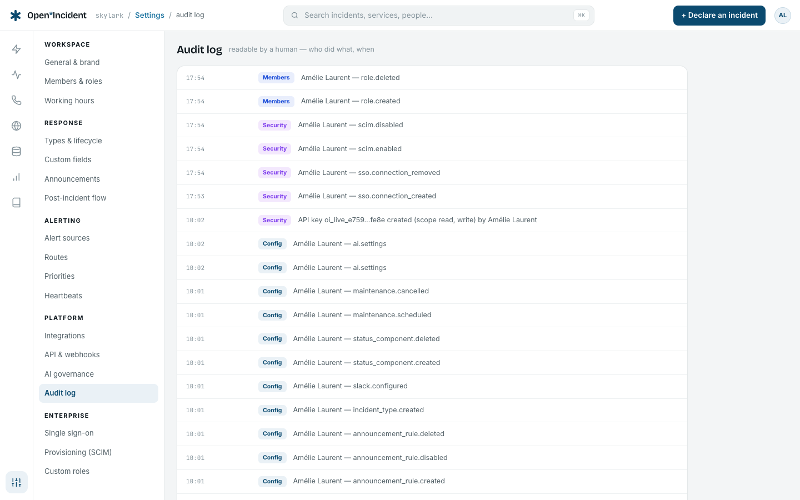

## Integrations

One card per tool, filtered by category. **Alert sources** cards open the source screen; **Trackers** (GitHub Issues, GitLab Issues, Jira, Linear) and **Documentation** (Confluence, Notion) cards take credentials that are **tested before being saved**, encrypted at rest and never shown again; **Chat** cards (Slack, Microsoft Teams, and the war-room link template) run their own three-step flows; the **SSO** card points to the enterprise screens. A card whose instance-side prerequisite is missing says so — _Slack is not configured on this instance (SLACK_CLIENT_ID…)_ — rather than pretending.

Each integration has its own chapter: [Slack](slack), [Microsoft Teams](teams), [Trackers and documentation tools](trackers-docs).

## API & webhooks

### API keys

**+ New key** with a name and **scopes**: `read` (incidents, follow-ups, catalog), `write` (everything, updates included), `incident:create` (declare incidents only — the narrow scope of an ingestion key). The key `oi_live_…` is shown **once**; only its SHA-256 is stored. Each row shows its last use; **Revoke** takes effect on the next request.

The **contract**: cursor pagination, 100 items at most, 600 requests per minute per key, errors always as `{ error: { code, message } }`, an OpenAPI document at `/api/v1/openapi.json`. See [API and automation](api).

### Outbound webhooks

**+ Endpoint** with a URL and the **events** to subscribe to. The signing secret is shown once. Each delivery carries `x-oi-event`, `x-oi-timestamp` and `x-oi-signature: sha256=HMAC-SHA256(secret, body)`. Webhooks fire after the commit, never inside it: a slow receiver never slows an update. Failures are retried three times, then kept for a manual **Resend**; an endpoint failing for seven days is disabled. **Deliveries** lists every attempt with its status.

## AI governance

Described in [The assistant](ai#governance).

## Audit log

Readable by a human: _Amélie invited karim@… as responder_, _Role of Karim: responder → Alerting admin_, _API key …a1f2 created (scope write)_, _Okta SSO sign-in — new session for sam@…_, _published v7 of the escalation path "Platform primary"_. Four categories — **Config**, **Security**, **Members**, **Data** — and a filter per category. Changes made through the API are attributed to the key's name; changes made by SCIM to _SCIM provisioning_.

Sensitive imports (status page subscribers, purge) are reserved to the owner and audited.

## Enterprise

The last group — **Single sign-on**, **Provisioning (SCIM)**, **Custom roles** — belongs to the enterprise edition and is described in its own chapters. Without the entitlement each screen says _Unavailable on this instance_ and names the variable that switches it on.
