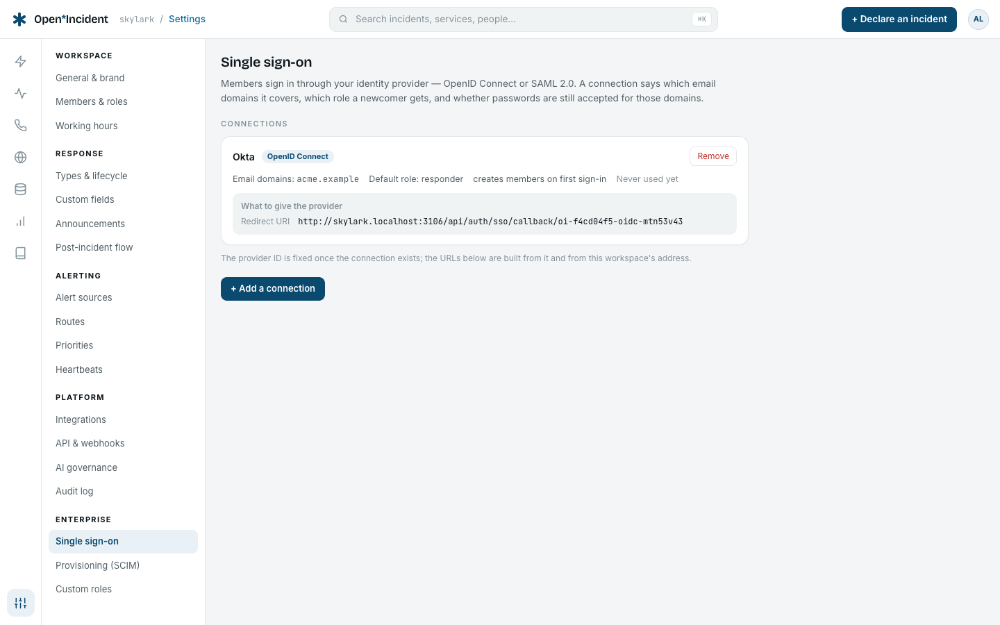

## What a connection is

**Settings → Single sign-on** holds the workspace's connections. Each one says:

- the **protocol** — OpenID Connect or SAML 2.0 — and the provider's details;
- the **button label** members click on the sign-in page (_Okta_, _Entra ID_…);
- the **email domains** it covers (empty: any email may use it);
- the **role of a new member** and whether to **create the member on first sign-in** (just-in-time). Without it, only existing members get in;
- **SSO only**: refuse password sign-in for the covered domains.

## OpenID Connect

Works with Okta, Microsoft Entra ID, Google Workspace, Keycloak, Auth0 and any provider with a discovery document.

### In the provider

Create a **web application** with the authorization code flow (PKCE is used). You will need its **Client ID** and **Client secret**. Leave the redirect URI for the next step.

### In the product

1. **+ Add a connection**, protocol **OpenID Connect**.
2. **Issuer URL**: the provider's issuer, e.g. `https://acme.okta.com` or `https://login.microsoftonline.com/<tenant id>/v2.0`. Discovery is read from `<issuer>/.well-known/openid-configuration` when the connection is created — a wrong issuer is refused at once, with the provider's answer.
3. **Client ID**, **Client secret**, **Button label**, **Email domains**, **Role of a new member**, the two checkboxes.
4. **Create the connection.** The row now shows the **Redirect URI**: `https://<workspace host>/api/auth/sso/callback/<provider id>`.

### Back in the provider

Register that redirect URI on the application. Grant the scopes `openid email profile`. Assign the users or groups who may sign in.

> An identity provider on a private address (an internal Keycloak) is refused by default: the operator lists its origin in `SSO_TRUSTED_IDP_ORIGINS`.

## SAML 2.0

1. **+ Add a connection**, protocol **SAML 2.0**.
2. Either paste the **IdP metadata XML**, or fill the **IdP entity ID**, the **IdP sign-on URL** and the **IdP signing certificate (PEM)**.
3. **Create the connection.** The row shows what the provider needs: the **ACS URL** (`…/api/auth/sso/saml2/sp/acs/<provider id>`), the **service provider entity ID**, and the **service provider metadata** address, served by the instance.
4. In the provider, create a SAML application with those values; map the email to the `NameID` or an `email` attribute, and the display name to `name` / `displayName`.

## Signing in through SSO

The sign-in page shows **Continue with <label>** for each connection. The provider signs the member in; the product then:

- finds the member by email — or **creates** it with the connection's role when just-in-time is on and the email's domain is allowed;
- activates an invited member who arrives this way;
- refuses a **disabled** member, exactly like a password sign-in;
- writes an audit line: _<label> SSO sign-in — new session for <email>_.

Members created this way carry the source _sso_ in the members list.

## SSO only

With **SSO only** on, a password sign-in for an email of a covered domain is refused with _This workspace requires single sign-on for your email domain_. The rule is checked before the password, so it cannot be brute-forced around.

A guard refuses a configuration that would lock every owner out: with enforcement on for every domain, at least one active owner must have an email outside the covered domains — or turn enforcement on after a first successful SSO sign-in.

## Removing a connection

**Remove** on the row deletes the connection and the provider record. Members created by it stay members; they sign in with a password reset, or through another connection.

## Notes for operators

- The auth base URL is derived from each workspace host (checked against `BASE_DOMAIN`), so callbacks land on the workspace that started the flow. `BETTER_AUTH_URL` pins it when a control plane needs one callback host.
- The OIDC client secret is stored in the provider record read by the sign-in plugin; the SCIM token, by contrast, is stored hashed.
- The SAML round trip requires the provider's signing certificate; assertions signed with an unknown certificate are refused.
