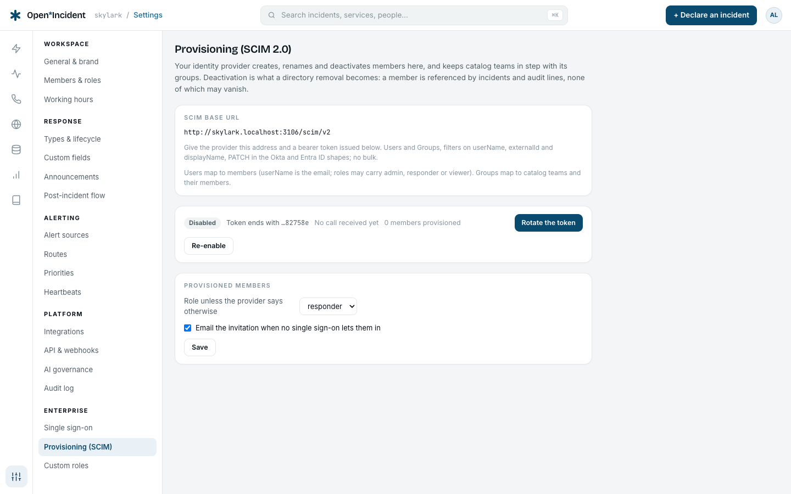

## Enabling the endpoint



**Settings → Provisioning (SCIM) → Enable and issue a token**. The screen shows:

- the **SCIM base URL**: `https://<workspace host>/scim/v2`;
- the **bearer token** `oi_scim_…`, **shown once** — copy it into the provider now. Only its hash is stored; a lost token is rotated, never recovered;
- the options for **provisioned members**: their **role** unless the provider says otherwise (`admin`, `responder`, `viewer`), and whether to **email the invitation** when no single sign-on lets them in.

**Rotate the token** kills the old one at once; **Disable** closes the endpoint (401 on every call) without losing anything.

## In Okta

Applications → your Open Incident app → **Provisioning** → _Configure API Integration_: base URL `https://<workspace host>/scim/v2`, authentication _HTTP Header_ with the token. Test, save, then enable _Create Users_, _Update User Attributes_, _Deactivate Users_. Push groups from the **Push Groups** tab.

## In Microsoft Entra ID

Enterprise applications → your app → **Provisioning** → mode _Automatic_: tenant URL `https://<workspace host>/scim/v2`, secret token. Test the connection, save, set the scope (assigned users and groups), start provisioning.

## What the endpoint supports

| Resource                                                            | Supported                                                                                                                                                                                                                                                                          |
| ------------------------------------------------------------------- | ---------------------------------------------------------------------------------------------------------------------------------------------------------------------------------------------------------------------------------------------------------------------------------- |
| `ServiceProviderConfig`, `ResourceTypes`, `Schemas`                 | Discovery.                                                                                                                                                                                                                                                                         |
| `GET /Users`                                                        | List with `startIndex` and `count` (200 at most), filters `userName eq "…"`, `externalId eq "…"`, `emails.value eq "…"`, `displayName eq "…"`, `id eq "…"`.                                                                                                                        |
| `POST /Users`                                                       | Create a member: `userName` is the email; `name.givenName` / `familyName` or `displayName` the name; `externalId` kept; `roles[0].value` may be `admin`, `responder` or `viewer`; `active: false` creates a disabled member. `409` when the email exists.                          |
| `GET`, `PUT`, `PATCH /Users/{id}`                                   | Read, replace, or patch — Okta's `path` form and Entra ID's object form both accepted: `active`, `userName`, `emails`, `name.*`, `displayName`, `externalId`, `roles`. Attributes the member does not carry (title, phone, locale…) are accepted and ignored.                      |
| `DELETE /Users/{id}`                                                | **Deactivates** the member. Nothing is erased: a member is referenced by incidents and audit lines.                                                                                                                                                                                |
| `GET`, `POST /Groups`, `GET`, `PUT`, `PATCH`, `DELETE /Groups/{id}` | Groups are **catalog teams**: `displayName` is the team's name, `members[].value` the member ids. `PATCH` adds and removes members (`members` with a value list, or `members[value eq "…"]` to remove one). Deleting a team the routing still leans on is refused with the usages. |
| Bulk                                                                | Not supported (`501`).                                                                                                                                                                                                                                                             |

## What happens on the product side

- A provisioned member appears in **Members & roles** with the source _scim_. If the workspace has an SSO connection, the member is **active** at once and signs in through it; otherwise the member is **invited** and receives the invitation email when the option is on.
- An **owner** cannot be deactivated or demoted through SCIM; the call answers `403`.
- Deactivation is what a directory removal becomes: the member is refused at the door, and everything they did stays attributed.
- Every change is an audit line attributed to _SCIM provisioning_.
- The endpoint answers with `application/scim+json` and the standard error envelope (`urn:ietf:params:scim:api:messages:2.0:Error`).

## Checking with curl

```bash
BASE=https://acme.your-domain.example/scim/v2
TOKEN=oi_scim_…
curl -H "Authorization: Bearer $TOKEN" "$BASE/ServiceProviderConfig"
curl -H "Authorization: Bearer $TOKEN" "$BASE/Users?filter=userName%20eq%20%22jane%40acme.example%22"
```
