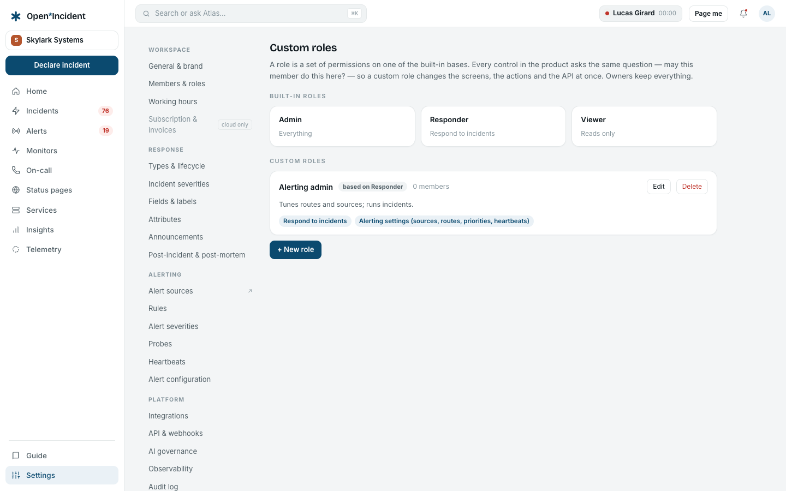

## The permission model

Every control in the product asks one question — _may this member do this here?_ — answered by ten permissions:

| Permission           | Grants                                                               |
| -------------------- | -------------------------------------------------------------------- |
| `incidents.respond`  | Declare, update, assign, resolve incidents; act on alerts.           |
| `oncall.manage`      | Schedules, rotations, overrides, escalation paths.                   |
| `statuspages.manage` | Status pages, components, maintenances.                              |
| `insights.manage`    | Pay reports and exports in Reports.                                  |
| `settings.workspace` | General & brand, working hours.                                      |
| `settings.members`   | Members, roles, single sign-on, provisioning.                        |
| `settings.response`  | Types & lifecycle, custom fields, announcements, post-incident flow. |
| `settings.alerting`  | Alert sources, routes, priorities, heartbeats.                       |
| `settings.platform`  | Integrations, API & webhooks, AI governance.                         |
| `audit.view`         | The audit log.                                                       |

The built-in roles are fixed sets: **Owner** and **Admin** hold everything; **Responder** holds `incidents.respond`; **Viewer** holds nothing and reads. Nothing changes for them.

> Instances upgraded from a version that still had the service catalogue may see two extra checkboxes in the form, `catalog.entries` and `catalog.manage`. The catalogue they governed no longer exists and they grant nothing; leave them unticked.

## Creating a role

**Settings → Custom roles → + New role**:

1. A **name** (_Alerting admin_, _Status page editor_, _Auditor_) and a description.
2. A **base role** — admin, responder or viewer. It is what the member is shown as in the product, and what integrations without a permission model (a Slack command, for instance) fall back to.
3. The **permissions**, as checkboxes.

**Save the role**, then assign it from **Members & roles**: the role select lists custom roles as _Name · base_. A role held by members cannot be deleted; the message names them.

## Examples

| Role               | Base      | Permissions                              | Who it is for                                                                          |
| ------------------ | --------- | ---------------------------------------- | -------------------------------------------------------------------------------------- |
| Alerting admin     | responder | `incidents.respond`, `settings.alerting` | The SRE who tunes routes and sources but should not touch members or integrations.     |
| Status page editor | viewer    | `statuspages.manage`                     | Support or communications: publishes and schedules maintenances, never runs incidents. |
| Auditor            | viewer    | `audit.view`                             | Compliance: reads the audit log, nothing else.                                         |
| On-call manager    | responder | `incidents.respond`, `oncall.manage`     | The team lead who owns the schedules and the escalation paths, and nothing else.       |

## What changes for a holder

- The **Settings** entry appears when the role holds any settings permission; the settings navigation shows only the screens the role holds, and **Settings** lands on the first of them.
- On every screen, the controls that manage that area appear or disappear with the corresponding permission — the status page's components and maintenances with `statuspages.manage`, the on-call editing with `oncall.manage`…
- Server actions and API routes enforce the same permissions: a control that was hidden would be refused anyway.
- Without the `customRoles` entitlement, holders fall back to their base role.

## Owners

Owners keep everything and cannot be assigned a custom role through SCIM or demoted by it. Only an owner appoints another owner.
