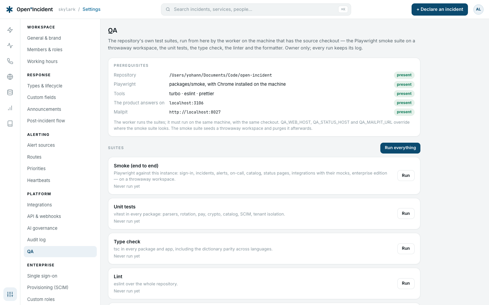

## The processes

| Process     | Does                                                                                                                                                             |
| ----------- | ---------------------------------------------------------------------------------------------------------------------------------------------------------------- |
| **web**     | The product: pages, server actions, the public API, the ingest endpoints, the auth endpoints, the SCIM endpoint. Stateless; scale horizontally behind the proxy. |
| **status**  | The public status pages, from a snapshot. Stateless.                                                                                                             |
| **worker**  | Background jobs from Redis queues. Run **exactly one** instance unless you know the queues are safe to share; several workers compete for the same jobs.         |
| **migrate** | One-shot: migrations, application role and row-level security, optional demo seed. Runs before the others on every `docker compose up`.                          |

### The worker's queues

| Queue              | Cadence           | Job                                                        |
| ------------------ | ----------------- | ---------------------------------------------------------- |
| `mail-send`        | on demand         | The outbox: every email leaves from here with a status.    |
| `notify-send`      | on demand         | Pages: SMS, voice, push, chat DMs.                         |
| `escalation-tick`  | every few seconds | Advances running escalations: levels, retries, exhaustion. |
| `update-reminders` | on demand         | "Update overdue" reminders to incident leads.              |
| `webhook-dispatch` | on demand         | Outbound webhooks with retries.                            |
| `oncall-sweep`     | 30 s              | Shift reminders, cover requests, handovers.                |
| `heartbeat-sweep`  | 30 s              | Late heartbeats raise or resolve alerts.                   |
| `status-sweep`     | 60 s              | Maintenance transitions, status snapshots.                 |
| `tracker-sync`     | 5 min             | Issue states from GitHub, GitLab, Jira, Linear.            |
| `coverage-sweep`   | 6 h               | Coverage gaps digest to managers (at most one a day).      |
| `runbook-sync`     | 6 h               | Refreshes runbooks fetched from URLs.                      |
| `housekeeping`     | daily             | Retention and cleanup.                                     |

The worker logs each processed job; a job that throws is retried by BullMQ with backoff and then left in the failed set, visible in the Redis-backed queue.

## Logs

All three processes log to standard output, one line per event, with the workspace slug when one is resolved. Better Auth logs its warnings at startup (a short secret, an unset base URL). Emails without a transport are written to the logs in full — useful in development, a misconfiguration in production.

## Backups and restore

- **Database**: `pg_dump` of the `openincident` database, nightly. Restore with `pg_restore`, then run `docker compose run --rm migrate` to reapply the application role's policies.
- **Object storage**: copy the bucket; logos live under `tenants/<tenant id>/`.
- **Redis**: nothing to back up; a lost queue leaves outbox entries with the status `failed`.

## Upgrades

`git pull`, `docker compose build`, `docker compose up -d`. The `migrate` service applies pending migrations before web, status and worker restart. Read `CHANGELOG.md` for new variables and behaviour changes.

## Removing a workspace

```bash
docker compose run --rm migrate pnpm workspace:purge -- --slug acme --yes
```

The purge erases every `app` table row of the workspace, the directory rows, the sign-in accounts no other workspace still lists, and the storage prefix — then **counts what remains** in each table and lists the remaining objects, and **fails if anything is left**. The output is the proof; keep it.

## QA from the admin

**Settings → QA** (owners only) runs the repository's own test suites from the product and keeps every run with its log:

| Suite                  | What runs                                                                                                                                                                                          | Typical duration |
| ---------------------- | -------------------------------------------------------------------------------------------------------------------------------------------------------------------------------------------------- | ---------------- |
| **Smoke (end to end)** | Playwright against this very instance, on a throwaway workspace seeded for the run and purged afterwards — every journey of the product, the integrations with their mocks, the enterprise edition | 8–10 min         |
| **Unit tests**         | vitest in every package                                                                                                                                                                            | 1–2 min          |
| **Type check**         | tsc in every package and app, dictionary parity included                                                                                                                                           | 1–2 min          |
| **Lint**               | eslint over the repository                                                                                                                                                                         | under a minute   |
| **Formatting**         | prettier --check over the repository                                                                                                                                                               | under a minute   |

The worker executes them, one at a time, on the machine that has the **source checkout with its dependencies installed** — a development machine, or a server deployed from source. A container built from the standalone image has none of that, and the screen says _Unavailable on this instance_. The screen lists the prerequisites it can see: the repository path, Playwright, the tools, whether the product answers where the smoke suite will look, whether Mailpit answers.

Three variables tell the smoke suite where to look when they differ from the defaults: `QA_WEB_HOST` (default `BASE_DOMAIN`), `QA_STATUS_HOST` (default `STATUS_BASE_DOMAIN`), `QA_MAILPIT_URL` (default `http://localhost:8027`). The worker must be restarted after changing them.

A run shows its status live, the command, the exit code, the counts, **what failed** with a location and the first line of the error, and the log. **Stop** ends a running suite. Every launch and cancellation is an audit line.



## Monitoring the product itself

- Point your monitoring at `GET /login` of the bare domain (web) and at a status page (status). A `200` from both is the liveness you need.
- Watch the worker's process; a stopped worker means pages, emails and escalations pile up in Redis and leave when it returns — the outbox tells the truth about what left and when.
- A **heartbeat** of the product's own scheduled jobs is a good idea once you trust it: give the worker's housekeeping job a heartbeat URL of a _different_ instance.
- The smoke suite (`packages/smoke`) can run against a staging instance: it seeds a throwaway workspace, exercises every journey, purges it and proves the purge.

## Troubleshooting

| Symptom                                               | Cause and fix                                                                                                                                                                                                                                   |
| ----------------------------------------------------- | ----------------------------------------------------------------------------------------------------------------------------------------------------------------------------------------------------------------------------------------------- |
| Every page answers **404**                            | The host does not match `BASE_DOMAIN` (port included in development) or the subdomain is not a workspace. Check the proxy forwards `Host`.                                                                                                      |
| The page after a save shows **another workspace**     | The proxy does not forward `X-Forwarded-Host`; the product needs it behind a proxy.                                                                                                                                                             |
| **Emails never arrive**                               | No transport configured: they are in the logs. Check `MAIL_FROM` and the `SMTP_*` or API key. Members' outboxes show `failed` with the reason.                                                                                                  |
| **Nobody is paged**                                   | Read the alert's **History**: _no route matched_, _test mode_, or a level whose schedule has nobody on call (**Test the path** says so). Then the member's **My notifications**: an unverified phone, a channel _unavailable on this instance_. |
| **SMS / voice / push "unavailable on this instance"** | `TWILIO_*` or `WEBPUSH_*` are not set.                                                                                                                                                                                                          |
| **Logo upload unavailable**                           | `S3_*` not set. A partial set stops the process at startup, on purpose.                                                                                                                                                                         |
| **The assistant is unavailable**                      | `AI_API_BASE` and `AI_MODEL` not set, or switched off in AI governance.                                                                                                                                                                         |
| **SSO: "not publicly routable"**                      | The identity provider is on a private address: add its origin to `SSO_TRUSTED_IDP_ORIGINS`.                                                                                                                                                     |
| **SSO callback lands on the wrong host**              | `BETTER_AUTH_URL` is pinned to another host; unset it, or set `AUTH_COOKIE_DOMAIN` for a shared cookie.                                                                                                                                         |
| **SCIM answers 403**                                  | The `sso` entitlement is missing from `OI_ENTITLEMENTS`. **401**: the token is wrong, rotated or the endpoint disabled.                                                                                                                         |
| **"Too many attempts" at sign-in**                    | The sign-in rate limit; wait ten seconds.                                                                                                                                                                                                       |
| **Heartbeat alerts never fire in the compose stack**  | The worker cannot reach the web app: set `INTERNAL_WEB_ORIGIN=http://web:3000`.                                                                                                                                                                 |
| **The status page is stale**                          | The `status-sweep` job runs every 60 s in the worker; check the worker is up.                                                                                                                                                                   |
