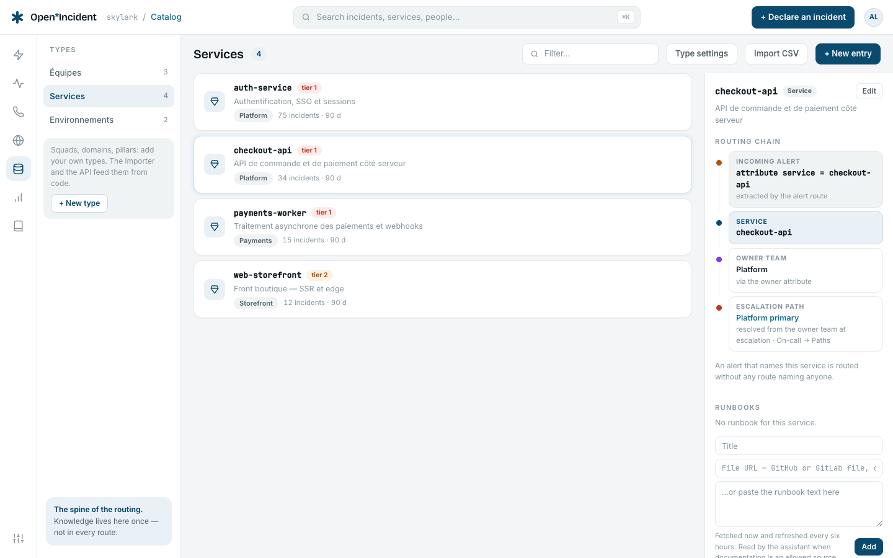
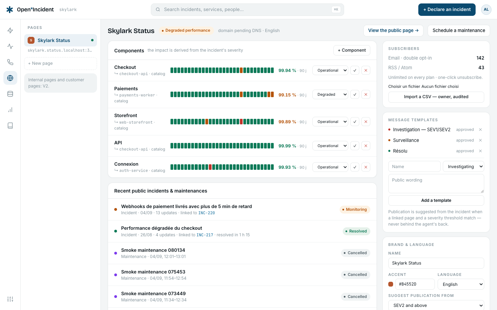

Open Helpdesk is the support desk we ship (ticketing, bidirectional email, automations, SLA, portal). It runs as a hosted service — `*.stg.open-helpdesk.com` today, production soon, same code — with a control plane that provisions workspaces and bills them. This chapter configures Open Incident to watch it: the services to declare, the signals to send, who gets paged, what customers see. Every step names the screen and gives the payload or command to use; the last section says plainly what works today and what still needs a few lines in Open Helpdesk itself.

## 1. What we are monitoring

### The topology

One virtual machine (Scaleway) behind **Caddy** (wildcard TLS), running:

| Process                         | Repository             | Role                                                                                                                                                                                                                                                                                                              | Hosts                                                             |
| ------------------------------- | ---------------------- | ----------------------------------------------------------------------------------------------------------------------------------------------------------------------------------------------------------------------------------------------------------------------------------------------------------------- | ----------------------------------------------------------------- |
| **web**                         | public `open-helpdesk` | The product: agent workspace, customer portal, API, email ingress webhooks                                                                                                                                                                                                                                        | `<tenant>.stg.open-helpdesk.com`, `ingress.stg.open-helpdesk.com` |
| **worker**                      | public                 | Seven BullMQ queues: `sla-timers` (every 60 s), `mail-ingest`, `mail-send`, `imap-poll` (every 60 s), `automations` (every 5 min), `webhook-dispatch`, `housekeeping` (daily)                                                                                                                                     | —                                                                 |
| **console**                     | private `cloud`        | The internal console: tenants, provisioning, billing, health (CO-10); the Stripe webhook; the gateway the product calls for checkout and invoices                                                                                                                                                                 | `console.stg.open-helpdesk.com`                                   |
| **worker-cloud**                | private                | `provisioning` (create tenant → seed defaults → provided mailbox → welcome email; the Brevo/DNS mail route; suspend, reactivate, purge), `cloud-housekeeping` (hourly: trials ending and expired, dunning at day 14, scheduled purges, unconfirmed addresses), `health-check` (one sample per service per minute) | —                                                                 |
| **www**                         | private                | The marketing site and the sign-up funnel                                                                                                                                                                                                                                                                         | `www.stg.open-helpdesk.com`                                       |
| **postgres**, **redis**, **S3** | —                      | Managed PostgreSQL in production (compose in staging), Redis AOF, object storage for attachments and backups                                                                                                                                                                                                      | —                                                                 |

Monitoring today is Better Stack (uptime on `www` and a canary tenant, a heartbeat on `worker-cloud`) with a Better Stack status page. The console's **health** screen already reads a sample per minute for eleven services — CPU, memory, disk, app, worker, PostgreSQL, Redis, inbound email, outbound email, storage, webhooks — written by `worker-cloud`. That sampler is the best source of truth we have, and the natural thing to plug into Open Incident.

### The four services you named, and what they hide

| Service          | Made of                                                                                                                                                                                                                                                                                    | What can break — the signals worth an alert                                                                                                                                                                                                                                      |
| ---------------- | ------------------------------------------------------------------------------------------------------------------------------------------------------------------------------------------------------------------------------------------------------------------------------------------ | -------------------------------------------------------------------------------------------------------------------------------------------------------------------------------------------------------------------------------------------------------------------------------- |
| **Billing**      | console (`/api/stripe/webhook`, gateway `checkout-session`, `portal-session`, `invoices`, `recheck`), `cloud-housekeeping`, Stripe                                                                                                                                                         | Stripe webhook refused or failing (signature, handler error); `invoice.payment_failed` opening a dunning case (a business event, not an outage — but the team must see it); a trial expiry that suspends a paying customer by mistake; the hourly housekeeping tick not running. |
| **Email**        | outbound: web + worker `mail-send`, the `email_deliveries` outbox, the workspace's transport (Brevo, SMTP…); inbound: `ingress.*` webhooks (Brevo, Mailjet, generic), `imap-poll`, the `rejected_emails` log; provisioning of the per-tenant mail route (Brevo domain, Scaleway DNS, DKIM) | Outbound failure rate over 24 h above 5 % (the sampler's threshold); inbound rejections above 20/24 h; IMAP poll errors; the ingress answering 401 after a secret rotation; a tenant's mail route never verified.                                                                |
| **Workers**      | worker (7 queues), worker-cloud (3 queues)                                                                                                                                                                                                                                                 | No worker connected to Redis (the sampler's `worker` check); a scheduled tick missing — `sla-timers` stopped means SLA breaches go unnoticed; a queue piling failed jobs; the nightly `backup.sh` not running.                                                                   |
| **Provisioning** | worker-cloud `provisioning` jobs, `packages/provisioning` steps engine, Brevo and Scaleway DNS APIs                                                                                                                                                                                        | A `create` job failing or stuck at a step (`create_tenant`, `seed_defaults`, `provided_mailbox`, `welcome_email`); the `mail_route` job failing DKIM verification for longer than expected; a purge job failing.                                                                 |

Underneath them, five platform pieces that the sampler already measures and that every service depends on: the **web app** (a real tenant page), **PostgreSQL**, **Redis**, **S3 storage**, and the host (CPU, memory, disk). We declare them as services too: an incident on `postgres` is not a billing incident, and the status page's components need them.

### The principle

Open Incident is not a prober: it does not fetch URLs, read metrics or tail logs. It receives **alerts** (from a monitoring tool, or from the application itself), routes them through the **catalog** to the right people, opens **incidents**, and tells customers on a **status page**. So the configuration has two halves: what we declare in Open Incident, and the small number of places where Open Helpdesk has to _tell_ Open Incident something.

## 2. Workspace, members, roles

1. Create the workspace (see [Install and configure](install#your-own-workspace)): slug `openhelpdesk`, name _Open Helpdesk_, timezone `Europe/Paris`.
2. **Settings → Members & roles → + Invite** the team as **Responder**; the two people who own the configuration as **Admin**. A stakeholder who only reads gets **Viewer**.
3. Each responder verifies a phone in **On-call → My notifications**, sets _SMS immediately, voice call after 3 minutes_ on the high-urgency rule, and links Slack if the workspace uses it.

## 3. The catalog

One owning team is enough for a small team; the routing still deserves the chain, because the day a second team exists, nothing else changes. If billing and provisioning are owned by different people than the platform, make two teams (_Platform_, _Cloud_) and set the owners accordingly.

**Catalog → Import CSV**, or the importer with the bundle below, saved as `open-helpdesk-catalog.yaml`:

```yaml
types: []
entries:
  # Teams — the escalation path names the path created in step 4.
  - {
      type: team,
      name: Open Helpdesk,
      external_id: team_oh,
      attributes: { escalation_path: Open Helpdesk on-call, chat_channel: "#open-helpdesk-ops" },
    }

  # Environments — the `environment` attribute of every alert.
  - { type: environment, name: production, external_id: env_prod, attributes: { paging: pages } }
  - { type: environment, name: staging, external_id: env_stg, attributes: { paging: silent } }

  # The four services you named
  - {
      type: service,
      name: billing,
      external_id: oh_billing,
      description: "Stripe webhook, checkout and portal gateway, dunning, trials",
      attributes:
        {
          owner: Open Helpdesk,
          repository: Open-HelpDesk/cloud,
          tier: tier 1,
          environments: "production, staging",
        },
    }
  - {
      type: service,
      name: email,
      external_id: oh_email,
      description: "Outbound outbox and transports; inbound ingress, IMAP poll and mail routes",
      attributes:
        {
          owner: Open Helpdesk,
          repository: Open-HelpDesk/open-helpdesk,
          tier: tier 1,
          environments: "production, staging",
        },
    }
  - {
      type: service,
      name: workers,
      external_id: oh_workers,
      description: "worker (7 queues) and worker-cloud (provisioning, housekeeping, health-check)",
      attributes:
        {
          owner: Open Helpdesk,
          repository: Open-HelpDesk/open-helpdesk,
          tier: tier 1,
          environments: "production, staging",
        },
    }
  - {
      type: service,
      name: provisioning,
      external_id: oh_provisioning,
      description: "Tenant creation, mail route (Brevo + DNS), suspend, reactivate, purge",
      attributes:
        {
          owner: Open Helpdesk,
          repository: Open-HelpDesk/cloud,
          tier: tier 2,
          environments: "production, staging",
        },
    }

  # The platform underneath
  - {
      type: service,
      name: web-app,
      external_id: oh_web,
      description: "Agent workspace, portal, API — one tenant page probed per minute",
      attributes:
        {
          owner: Open Helpdesk,
          repository: Open-HelpDesk/open-helpdesk,
          tier: tier 1,
          environments: "production, staging",
        },
    }
  - {
      type: service,
      name: console,
      external_id: oh_console,
      description: "Internal console and gateway",
      attributes:
        {
          owner: Open Helpdesk,
          repository: Open-HelpDesk/cloud,
          tier: tier 2,
          environments: "production, staging",
        },
    }
  - {
      type: service,
      name: postgres,
      external_id: oh_postgres,
      attributes: { owner: Open Helpdesk, tier: tier 1, environments: "production, staging" },
    }
  - {
      type: service,
      name: redis,
      external_id: oh_redis,
      attributes: { owner: Open Helpdesk, tier: tier 1, environments: "production, staging" },
    }
  - {
      type: service,
      name: storage,
      external_id: oh_storage,
      description: "S3 attachments and backups",
      attributes: { owner: Open Helpdesk, tier: tier 2, environments: "production, staging" },
    }
  - {
      type: service,
      name: host,
      external_id: oh_host,
      description: "The VM: CPU, memory, disk",
      attributes: { owner: Open Helpdesk, tier: tier 1, environments: "production, staging" },
    }
```

```bash
pnpm catalog:import -- --source local --file open-helpdesk-catalog.yaml \
  --api https://openhelpdesk.<your open incident domain> --key oi_live_…
```

The names matter: they are the `service` attribute every alert will carry, and the parser binds an alert to a service by that exact name.



### Runbooks

On the `workers`, `provisioning` and `billing` services, **Runbooks → Add** the operator's runbook (`infra/RUNBOOK.md` of the private repository: topology, deployment, backups, restoration, secrets). The repository is private, so either paste the text, or give the GitHub URL once a GitHub tracker with a token that can read the repository is connected in **Settings → Integrations**. The runbook is then shown on every incident of those services, and quoted to the assistant when documentation is an allowed source.

## 4. On-call

1. **Settings → Working hours → + New set** _Paris business_: Mon–Fri 09:00–19:00.
2. **On-call → Escalation paths → + New path** _Open Helpdesk on-call_ — the name the team's `escalation_path` attribute carries:
   - **Level 1**: schedule _Open Helpdesk_ (on call now), high urgency, ack within 5 min, 2 retries.
   - **Condition** _Working hours "Paris business"?_ — YES: **Level 2** pages the _Open Helpdesk_ team members; NO: **Level 2** pages the team members at high urgency as well — at 3 a.m. the second person is the whole plan.
   - **Publish v1**, then **Test the path**: it must name someone right now.
3. **On-call → Schedules → + New schedule** _Open Helpdesk_: weekly, handover Monday 09:00 Europe/Paris, members in order. **Publish.** Check **Coverage · next 60 days** reads 100 %.

## 5. Alert sources

Three sources cover everything; each has its own endpoint and secret, shown once at creation. Paste them where indicated.

### 5.1 "Open Helpdesk health" — Generic HTTP, fed by the control plane

The sampler in `worker-cloud` already decides, every minute, whether each of the eleven services is `ok`, `wait` or `dang`. Sending that verdict to Open Incident is the highest-value change, and it is small. The generic parser reads these fields:

| Field                                        | Read as                                                                |
| -------------------------------------------- | ---------------------------------------------------------------------- |
| `title` (or `summary`, `name`, `message`)    | The alert's title                                                      |
| `description` (or `body`)                    | Its description                                                        |
| `status` (or `state`)                        | `firing` unless it matches _resolved, ok, recovered, closed, up_       |
| `dedup_key` (or `fingerprint`, `id`)         | The deduplication key — the same key means the same alert, more events |
| `service`, `environment`, `priority`         | Attributes bound to the catalog and to the priorities                  |
| `attributes` or `labels` (object of strings) | More attributes for the routes                                         |
| `url` (or `link`)                            | A link back — the console's health screen                              |

Create the source: **Settings → Alert sources → + New source → Generic HTTP**, name _Open Helpdesk health_. Then, in `open-helpdesk-cloud`, add an emitter next to the sampler and call it after `collectHealthSamples()` in `apps/worker-cloud/src/index.ts`:

```ts
// packages/cloud-health/src/incident-emitter.ts — one alert per service in trouble,
// resolved when the sample comes back to ok. Idempotent: the dedup key makes
// repeated firing samples one alert with more events.
import type { ServiceHealth } from "./checks";

const SERVICE_OF: Record<string, string> = {
  app: "web-app",
  worker: "workers",
  postgres: "postgres",
  redis: "redis",
  "mail-in": "email",
  "mail-out": "email",
  storage: "storage",
  webhooks: "web-app",
  cpu: "host",
  memory: "host",
  disk: "host",
};
const PRIORITY_OF: Record<string, string> = {
  app: "P1",
  worker: "P1",
  postgres: "P1",
  redis: "P1",
  "mail-out": "P2",
  storage: "P2",
  "mail-in": "P3",
  webhooks: "P3",
  cpu: "P2",
  memory: "P2",
  disk: "P1",
};

export async function emitToOpenIncident(services: ServiceHealth[]): Promise<void> {
  const url = process.env.OPEN_INCIDENT_INGEST_URL;
  const secret = process.env.OPEN_INCIDENT_INGEST_SECRET;
  if (!url || !secret) return; // not configured: nothing to send, nothing to pretend
  const environment = process.env.OPEN_INCIDENT_ENVIRONMENT ?? "staging";
  for (const s of services) {
    if (s.kind === "wait") continue; // a warning is a console colour, not a page
    const body = {
      title: s.kind === "dang" ? `${s.name} is down` : `${s.name} is back`,
      description: `${s.latencyLabel} · ${s.errLabel}`,
      status: s.kind === "dang" ? "firing" : "resolved",
      dedup_key: `oh:${environment}:${s.key}`,
      service: SERVICE_OF[s.key] ?? "host",
      environment,
      priority: PRIORITY_OF[s.key] ?? "P2",
      url: `https://console.${process.env.BASE_DOMAIN}/health`,
      attributes: { check: s.key },
    };
    await fetch(url, {
      method: "POST",
      headers: { "content-type": "application/json", "x-oi-secret": secret },
      body: JSON.stringify(body),
    }).catch((err) => console.error("[open-incident] emit failed:", err));
  }
}
```

A resolved sample posts `status: resolved` with the same `dedup_key`, which resolves the alert at the source — the route decides whether that also ends the escalation. Set `OPEN_INCIDENT_INGEST_URL` to the source's endpoint (`https://…/api/ingest/alerts/<source id>`), `OPEN_INCIDENT_INGEST_SECRET` to its secret and `OPEN_INCIDENT_ENVIRONMENT` to `staging` or `production` on the VM.

Two more emitters are worth the same handful of lines, each with its own `dedup_key`:

- **Billing** — in `packages/cloud-billing/src/webhook.ts`, when the Stripe handler throws or the signature check fails, post `{ title: "Stripe webhook failing", service: "billing", priority: "P1", dedup_key: "oh:<env>:stripe-webhook", status: "firing" }`; on the next successful event, post the same key with `status: resolved`. When a dunning case opens, post `{ title: "Payment failed — <tenant slug>", service: "billing", priority: "P3", dedup_key: "oh:<env>:dunning:<case id>" }` — routed as low urgency (see step 6), it becomes a trace in the alerts list rather than a page.
- **Provisioning** — in the `provisioning` worker's `failed` handler, post `{ title: "Provisioning <kind> failed — <slug>", service: "provisioning", priority: "P2", dedup_key: "oh:<env>:provisioning:<job id>", description: <step and error> }`.

Until those lines exist, the **Test** button on the source sends a real alert end to end in test mode, and `curl` sends a real one:

```bash
curl -X POST "https://…/api/ingest/alerts/<source id>" -H "x-oi-secret: <secret>" -H "content-type: application/json" \
  -d '{"title":"PostgreSQL is down","status":"firing","dedup_key":"oh:staging:postgres","service":"postgres","environment":"staging","priority":"P1","description":"injoignable"}'
```

### 5.2 "Public probes" — Generic HTTP, fed by the uptime checker

Open Incident does not probe URLs. Keep whatever probes them — Better Stack today, Uptime Kuma if you self-host one — and point its **webhook notification** at a second generic source named _Public probes_. Better Stack's webhook carries `data.attributes.status` (`down`/`up`) and the monitor name; map them with the source's mappings (`data.attributes.status` → `status`, monitor name → `title`) and set `service` per monitor through a label, or use Uptime Kuma, whose payload the **Uptime Kuma** source kind parses natively (monitor name as `service`). The probes to keep:

| Probe                                                                                                                             | Service                |
| --------------------------------------------------------------------------------------------------------------------------------- | ---------------------- |
| `https://www.stg.open-helpdesk.com/`                                                                                              | `web-app` (the funnel) |
| `https://acme.stg.open-helpdesk.com/login` (a canary tenant)                                                                      | `web-app`              |
| `https://console.stg.open-helpdesk.com/` (expects a redirect to login)                                                            | `console`              |
| `https://ingress.stg.open-helpdesk.com/api/ingress/email` (expects 401 without secret — a 404 or 5xx means Caddy or web is wrong) | `email`                |

### 5.3 Heartbeats — the scheduled jobs

**Settings → Heartbeats → New heartbeat**, one per job that must keep running. Each gets a URL to call at the end of the job (any method, no body). Nothing fires before the first ping; pausing during a planned stop forgets the last ping.

| Heartbeat                         | Service   | Expected every | Grace  | Where to ping                                                                          |
| --------------------------------- | --------- | -------------- | ------ | -------------------------------------------------------------------------------------- |
| worker · sla-timers tick          | `workers` | 1 min          | 2 min  | End of the `sla-timers` processor in `apps/worker/src/index.ts`                        |
| worker · housekeeping             | `workers` | 24 h           | 2 h    | End of the `housekeeping` processor                                                    |
| worker-cloud · health-check tick  | `workers` | 1 min          | 2 min  | After `collectHealthSamples()` — this one also proves the emitter above is alive       |
| worker-cloud · cloud-housekeeping | `billing` | 1 h            | 30 min | End of the hourly processor                                                            |
| backup.sh                         | `storage` | 24 h           | 2 h    | Last line of `infra/scripts/backup.sh`: `curl -fsS "$HEARTBEAT_BACKUP_URL" >/dev/null` |

In the workers, one line per processor: `await fetch(process.env.HEARTBEAT_SLA_TIMERS_URL!).catch(() => undefined);` — guarded by `if (process.env.HEARTBEAT_SLA_TIMERS_URL)`. Silence beyond the interval plus the grace raises an alert through the workspace's own _Heartbeats_ source, routed like any other; the next ping resolves it.


## 6. Priorities and routes

**Settings → Priorities**: keep P1 (high urgency), P2 (high), P3 (low), P4 (low). The emitter above sets the priority per check; the routes take it _from the payload_.

**Settings → Routes**, in this order — the first match wins:

| #   | Name               | Filters                                             | Escalation                                | Incident                                  | Notes                                                                                                                                         |
| --- | ------------------ | --------------------------------------------------- | ----------------------------------------- | ----------------------------------------- | --------------------------------------------------------------------------------------------------------------------------------------------- |
| 1   | Production — page  | `environment eq production` and `priority in P1,P2` | dynamic — service → owner team → its path | conditional — triage when urgency is high | Defer 2 min so a burst (host + postgres + app at once) groups before anyone is paged. _A resolution from the source ends the escalation_: on. |
| 2   | Production — trace | `environment eq production`                         | none — log only                           | never                                     | P3/P4: dunning cases, inbound rejections, webhook latency. Visible in Alerts and Reports, nobody woken.                                       |
| 3   | Staging            | `environment eq staging`                            | none — log only                           | never                                     | Staging is where we verify the chain; the team reads it, nobody is paged. Switch to _test mode_ while tuning filters.                         |
| 4   | Everything else    | —                                                   | none — log only                           | never                                     | A payload without `environment` is a configuration mistake, and this route makes it visible.                                                  |

Heartbeat alerts carry the heartbeat's service and the workspace's environment: give the _Heartbeats_ source's alerts `environment: production` through the source's mappings on the production instance, so route 1 pages for a dead worker.


## 7. Incident types, severities, announcements

The defaults fit. Two adjustments:

- **Settings → Types & lifecycle → Severities**: SEV1 _always_ enters the post-incident flow, SEV2 _yes_, SEV3 _opt-in at closure_. A SEV1 is customer-visible downtime (web app, postgres, redis); SEV2 a degraded service (email failure rate, billing webhook); SEV3 internal.
- **Settings → Announcements**: the seeded rule _Announce SEV1 / SEV2_ to the whole workspace, plus the Slack announcement channel if Slack is connected.

## 8. The status page for Open Helpdesk customers

This replaces the Better Stack status page.

1. **Status pages → + New page** `openhelpdesk`, visibility **Public**, language English (the customers' language), accent the product's colour, privacy and legal URLs of `open-helpdesk.com`, reply-to `support@open-helpdesk.com`.
2. **+ Component**, each bound to a catalog service:

   | Component                | Group       | Catalog service |
   | ------------------------ | ----------- | --------------- |
   | Agent workspace & portal | Application | `web-app`       |
   | Inbound email            | Email       | `email`         |
   | Outbound email           | Email       | `email`         |
   | Sign-up & provisioning   | Platform    | `provisioning`  |
   | Billing                  | Platform    | `billing`       |
   | API & webhooks           | Application | `web-app`       |

   Two components on the same service both take the impact of an incident on it; that is what customers expect (an email outage touches both directions).

3. **Suggest publication from SEV2 and above**. Nothing is published without the responder ticking the box in the update dialog.
4. **Domain**: `status.open-helpdesk.com`, CNAME to `status.<your open incident domain>`, **Save & verify DNS**; Caddy issues the certificate on first visit. **Indexing**: indexed once launched.
5. **Message templates**: _We are investigating an issue affecting … Tickets and emails are safe; delivery may be delayed._ — the sentence support wants to reuse at 3 a.m.
6. Import the current Better Stack subscribers as CSV (owner action, audited).

A second page, **internal**, `openhelpdesk-internal`, with the platform components (`postgres`, `redis`, `storage`, `host`, `console`) gives the team its own board without exposing the infrastructure.



## 9. Change events and the assistant

Deploys are the first suspect. In `infra/scripts/deploy-staging.sh`, after `up -d`, post one change event per deployed process:

```bash
for svc in web-app workers console provisioning; do
  curl -fsS -X POST "https://openhelpdesk.<oi domain>/api/v1/change-events" \
    -H "Authorization: Bearer $OI_API_KEY" -H "Content-Type: application/json" \
    -d "{\"kind\":\"deploy\",\"title\":\"$svc ${PRODUCT_VERSION} / cloud ${CLOUD_VERSION}\",\"service\":\"$svc\",\"environment\":\"staging\",\"actor\":\"deploy-staging.sh\"}"
done
```

The incident's side panel then lists the deploys of the day before it. With an inference provider configured on the Open Incident instance and **Settings → AI governance** allowing it, the assistant reads them, the runbook and the timeline to draft the summary and the post-mortem.

## 10. Dry run — proving the chain before trusting it

Run this on staging first, then on production the day it opens.

1. **Source test**: **Settings → Alert sources → Open Helpdesk health → Test**. The alert appears under **Alerts** in test mode: _logged and routed, nobody paged_. Open it: **Route** names _Staging_.
2. **A real staging alert**: the `curl` of section 5.1 with `environment: staging`. The alert is firing, routed by _Staging_, no incident, nobody paged — as designed. Post the same payload with `"status":"resolved"`: the alert resolves at the source.
3. **A production page** (with `environment: production`, `priority: P1`, `service: postgres`): the alert is routed by _Production — page_; its **History** reads _Incident INC-n created in triage_ and, two minutes later, _Level 1 notified — <name>_. The on-call person receives the SMS, taps **Acknowledge**: the card reads _Acknowledged by …, n minutes after the page_. In **Incidents → Triage**, accept with SEV1. Publish _Investigating_ on the status page; check `status.open-helpdesk.com` (or the instance address) shows _Agent workspace & portal — Major outage_. Post the resolved payload: the alert resolves, the escalation ends. Share **Resolved**: the page clears, the post-incident flow starts.
4. **Heartbeat**: create _backup.sh_ with _every 2 min, grace 1 min_ for the test, `curl` its URL once, wait three minutes: the alert fires through the Heartbeats source, routed like any other; `curl` again: it resolves. Then set the real cadence.
5. **Reports → Alerts** shows the sources and the alert → incident conversion; **Settings → Audit log** has every step.

If step 3 pages nobody, **On-call → Escalation paths → Test the path** says why (an unpublished schedule, nobody on call now, an unverified phone).

## 11. Does it work as-is? An honest assessment

| Need                                                                                       | Works today, without touching Open Helpdesk                                                     | Needs a small change in Open Helpdesk                                                                                                                                                 | Not covered by Open Incident                                                              |
| ------------------------------------------------------------------------------------------ | ----------------------------------------------------------------------------------------------- | ------------------------------------------------------------------------------------------------------------------------------------------------------------------------------------- | ----------------------------------------------------------------------------------------- |
| Catalog, on-call, escalation, incidents, timeline, post-incident, reports                  | Yes — the bundle above, the path, the schedule.                                                 |                                                                                                                                                                                       |                                                                                           |
| Public probes (www, canary tenant, console, ingress)                                       | Yes, through the existing prober's webhook (Better Stack or Uptime Kuma) into a generic source. |                                                                                                                                                                                       | Open Incident does not probe URLs itself; a prober must exist.                            |
| Platform health (app, worker, postgres, redis, mail-in, mail-out, storage, webhooks, host) | The sampler measures it already; the console shows it.                                          | **Yes**: the ~40-line emitter in `worker-cloud` (section 5.1) and three environment variables.                                                                                        |                                                                                           |
| Scheduled jobs (SLA timers, housekeeping, health-check, backups)                           | The `backup.sh` heartbeat is one `curl` line in a script we own.                                | One `fetch` line per processor in the two workers.                                                                                                                                    |                                                                                           |
| Billing: Stripe webhook failures, dunning                                                  |                                                                                                 | A `catch` and a dunning hook in `webhook.ts`.                                                                                                                                         | Open Incident does not talk to Stripe; it receives what we send.                          |
| Provisioning failures                                                                      |                                                                                                 | A `failed` handler on the `provisioning` worker.                                                                                                                                      |                                                                                           |
| Customer status page, subscribers, maintenances                                            | Yes — including the custom domain and the CSV import of today's subscribers.                    |                                                                                                                                                                                       |                                                                                           |
| Deploys next to incidents                                                                  | The `curl` loop in the deploy script.                                                           |                                                                                                                                                                                       |                                                                                           |
| Logs, metrics dashboards, tracing                                                          |                                                                                                 |                                                                                                                                                                                       | Not Open Incident's job; the console's health screen and Scaleway Cockpit keep that role. |
| A synthetic "email → ticket" journey (the product's key path)                              |                                                                                                 | Worth building: a cron sends an email to a canary mailbox, checks through the API that a ticket exists within two minutes, and pings a heartbeat; silence raises an alert on `email`. |                                                                                           |

Two things we learnt while mapping, worth a note for Open Incident itself: alerts from the built-in _Heartbeats_ source carry no `environment` unless a mapping adds one — on a single-workspace instance that watches both staging and production, the environment must come from the source or from separate workspaces; and the generic parser binds a service by its exact name, so the catalog names and the emitter's table must be kept in step — the importer with `--lock` on a `services.yaml` owned by the cloud repository is the way to keep them so.

## 12. Order of operations

1. Workspace, members, phones verified.
2. Catalog bundle imported; working hours, path published, schedule published, coverage 100 %.
3. Priorities checked; routes 1–4 created, _Staging_ in test mode.
4. Sources created; secrets stored on the VM as environment variables.
5. Emitter and heartbeat pings merged in `open-helpdesk-cloud` and `open-helpdesk`, deployed to staging.
6. Dry run of section 10 on staging; routes taken out of test mode.
7. Status page created, components bound, domain verified, subscribers imported; Better Stack page redirected.
8. Production: `OPEN_INCIDENT_ENVIRONMENT=production` on the production VM, route 1 pages.
